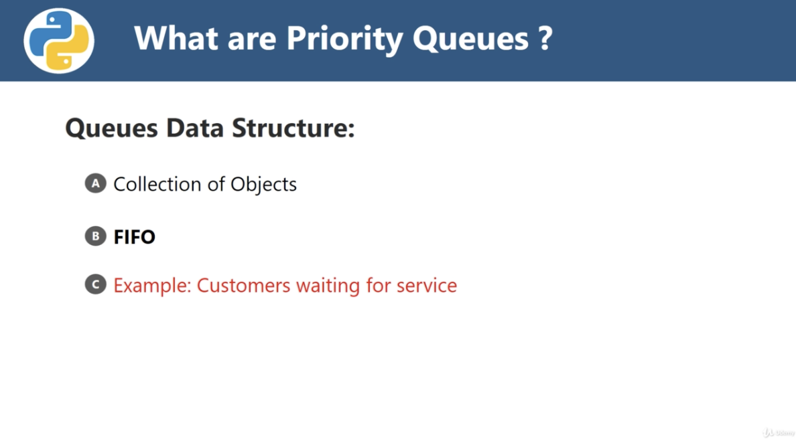
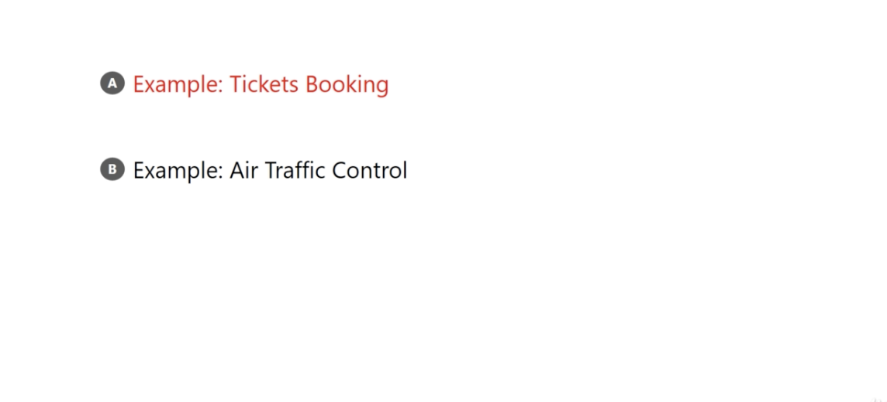
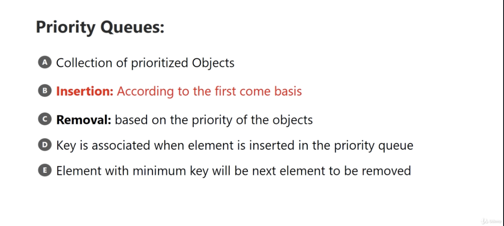

# What are Priority Queues and Why we need it

1. collections of objects
2. First-In First Out - different between Stack(Last in first out(LIFO))

</img>

</img>

(Ticket Booking) But the train agency or an airline may have a policy to serve senior citizens(老人，或當地市民) or people who need of urgent trouble.

# Priority Queues

</img>

1. insertion(enqueue) : still the same as queue
2. removal(dequeue) : pick thr highest priority
