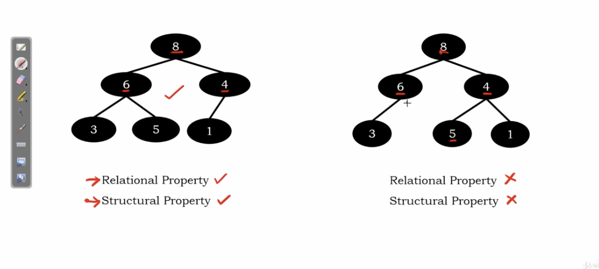

# Heap

A more efficient utilization of priority queues.

Using heap data structure, we can perform both insertion and deletion in much better way.

</img>

1. the value of the node should be greater or equal to those in its children.(we'll use it in the Tree-based deep learning model)

2. [binary tree should be complete binary tree.](../section_10/153_complete_binary_tree.md)

3. If property 1 is greater than, we have **max heap**. On the oppisite, we have **min heap**

# Examples

</img>

</img>

left is a heap, right is a not a heap.

</img>

left is a heap, right is not a heap.

note that there is no need to compare the value of node between the neighbor's.

</img>

neighter of them are heap.

# Heap Abstract Data Type

</img>
