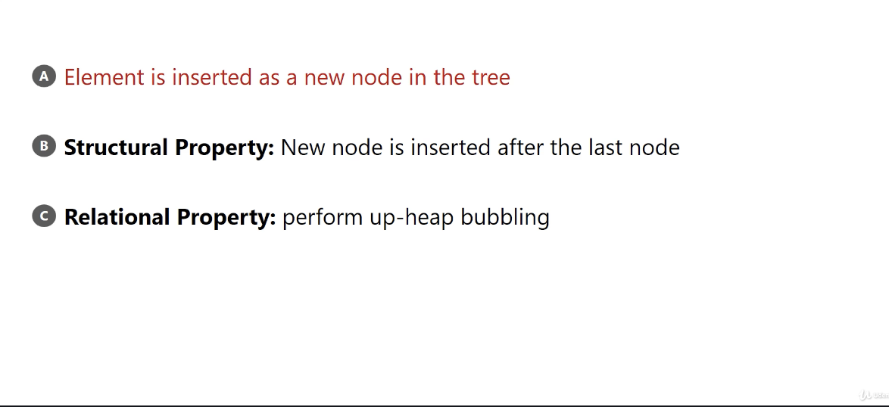
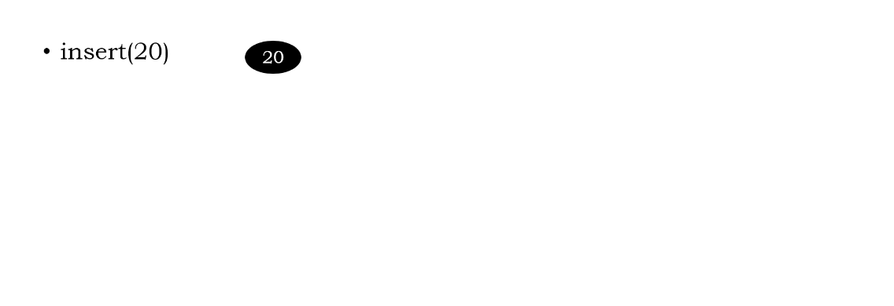
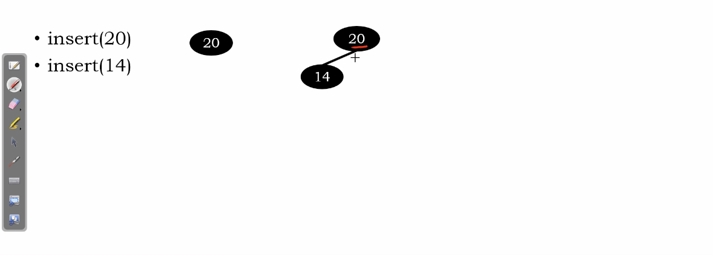
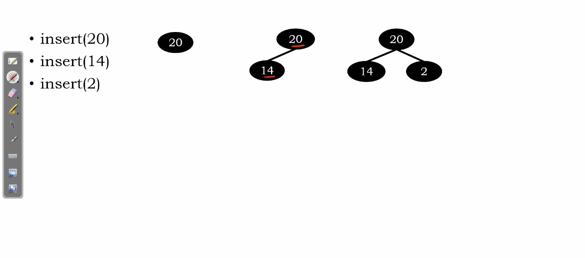
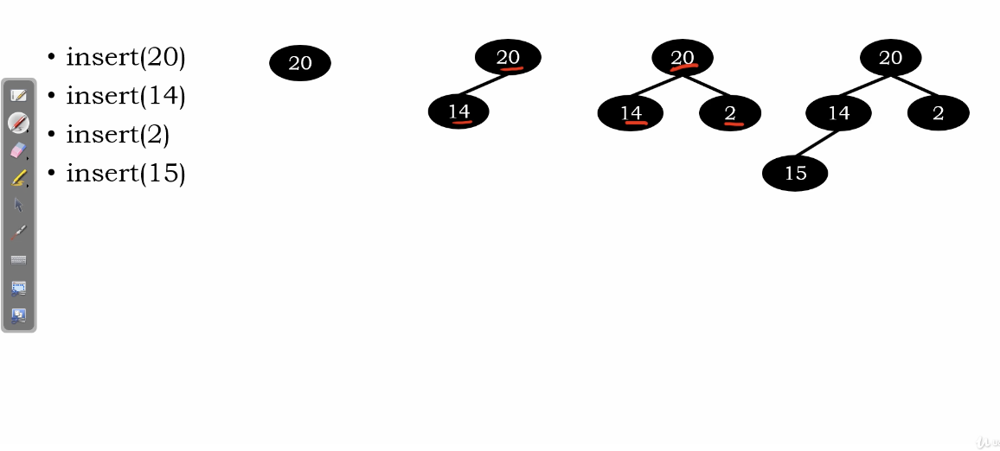
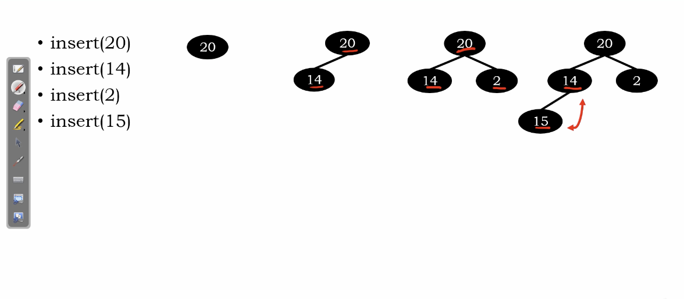
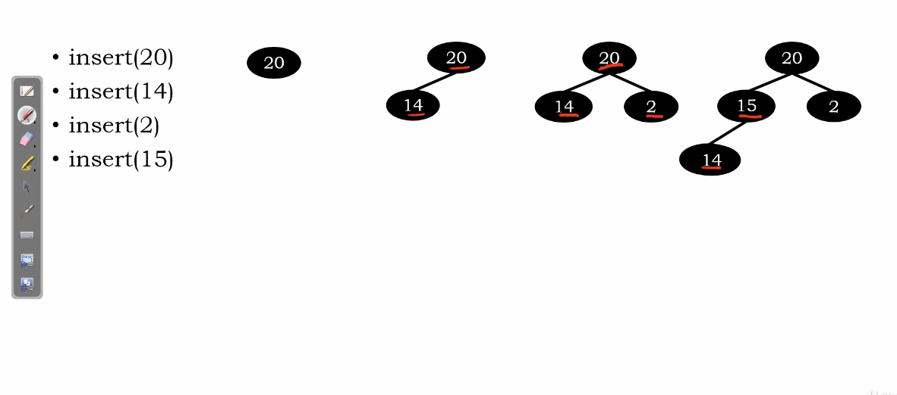
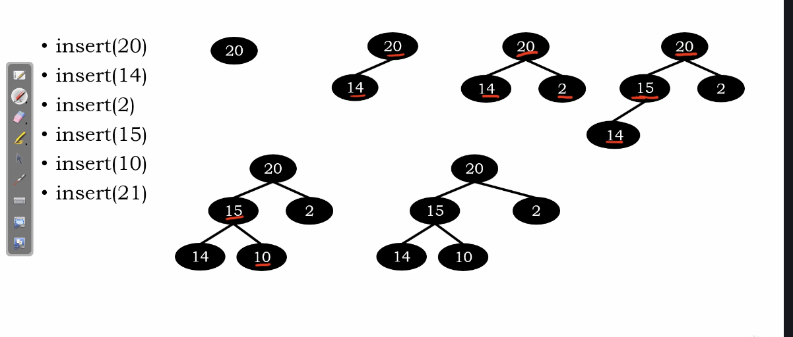
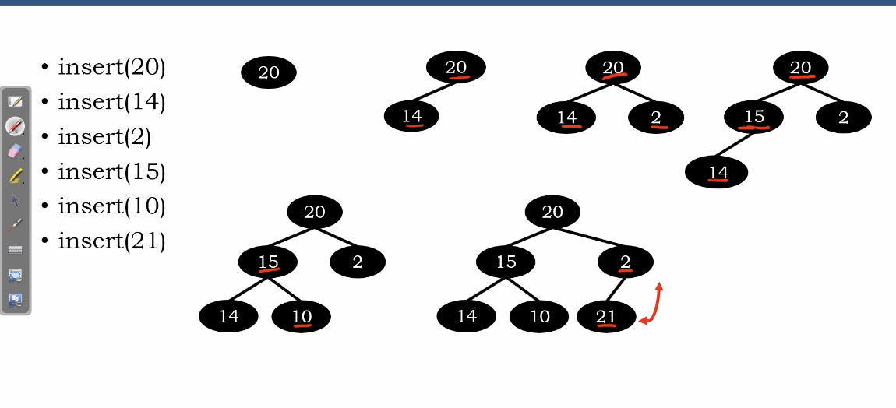
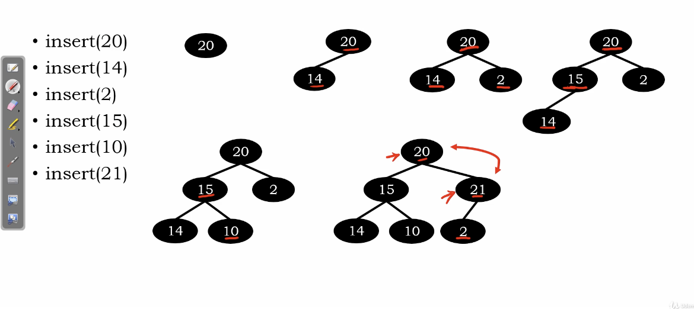

# Heap Insertion

</img>

need to satisfied two property.

1. we should insert new node by following complete binary tree insetion.
2. new node might break the relational property, we need change the node to make them fit the relational property again.(a.k.a. up-heap bubbling)

# Example

</img>

</img>

</img>

</img>

violate relational property, perform up-heap bubbling.

</img>

</img>

</img>

violate relational property, perform up-heap bubbling.

</img>

still, violate relational property, perform up-heap bubbling.

</img>

# Complexity analysis

Insertion : $O(1)$

Up-heap bubbling : $O(h)$, where $h$ is the level of the tree.

also, heap is a complete binary tree structure. so we have $h \propto log(n)$, where $n$ is the number of nodes
