# Heap Insertion Algorithm

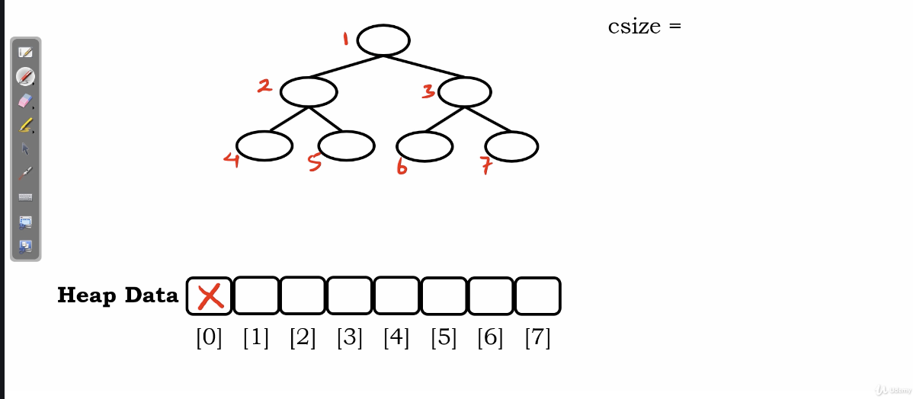</img>

we'll consider using array-based data structure to represent a binary tree.

the index 0 : we won't put anything here.

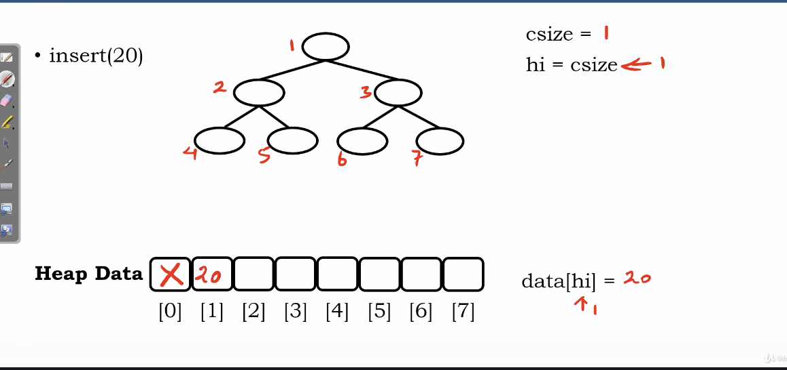</img>

csize : current size

hi : heap index

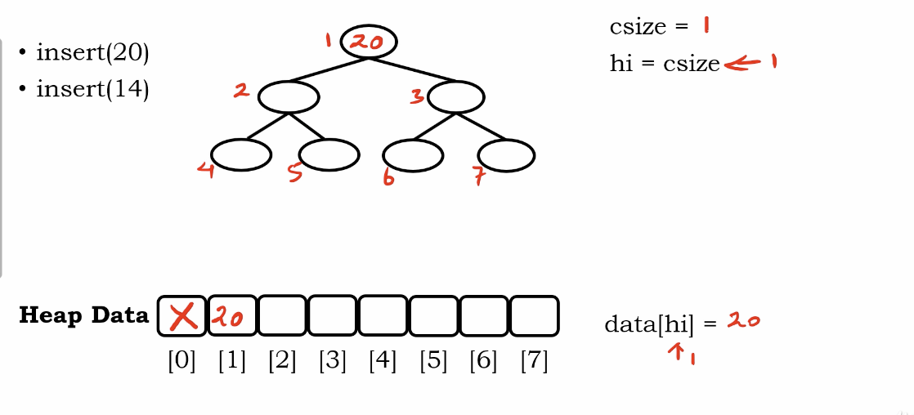</img>

is it match relational property?

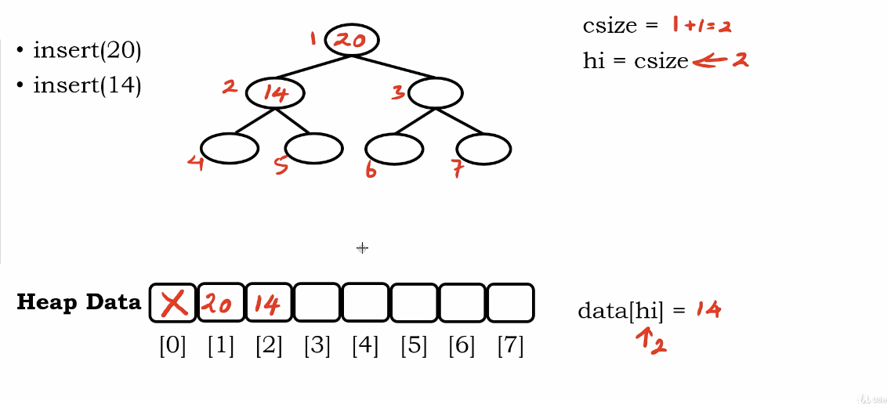</img>

``` Python
e > data[ floor[hi / 2] ]
# current value > its parent?
```

under array representation, the parent always be the floor(children / 2)

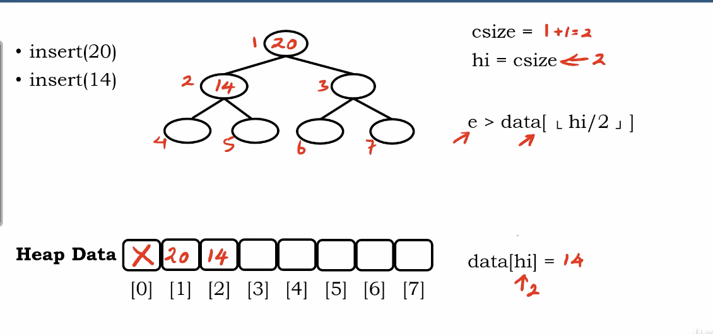</img>

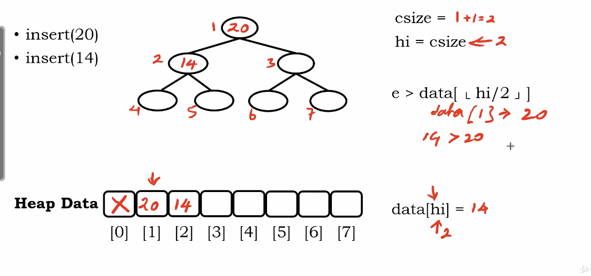</img>

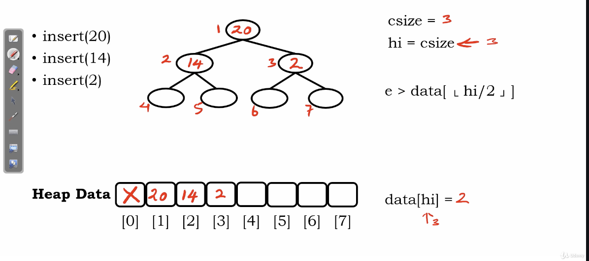</img>

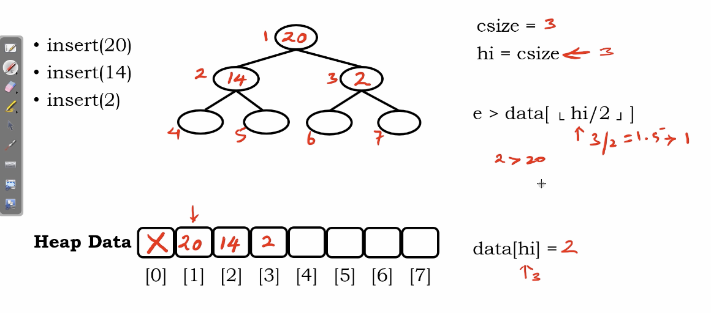</img>

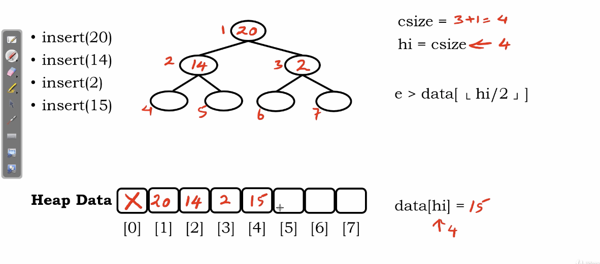</img>

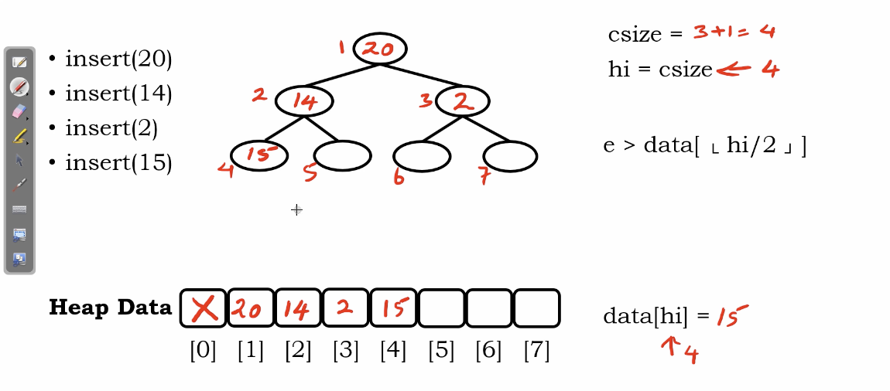</img>

we check $e=15$ > data[heap_index] or not

we need to perform up-heap-bobbling

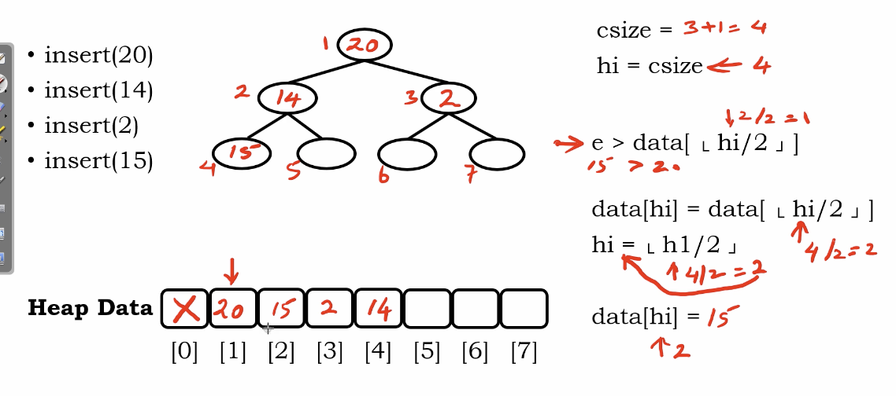</img>

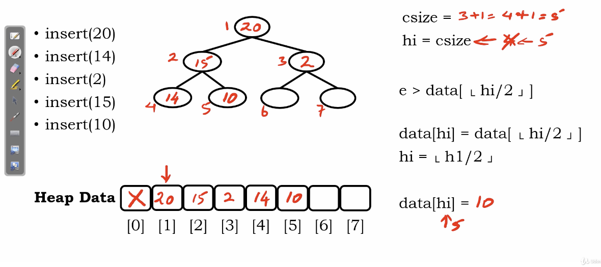</img>

Appreantly, the up-heap bubbling can be design as a recusion function or loop-style function.

``` Python
function heap_insertion(e)
  if curr_size == maxsize then
    print('No Space)
    return
  curr_size += 1
  heap_index = curr_size
  parent_index = floor(heap_index / 2)
  while heap_index > 1 and e > data[parent_index] then
    data[heap_index] = data[parent_index]
    heap_index = parent_index
  data[heap_index] = e
```
