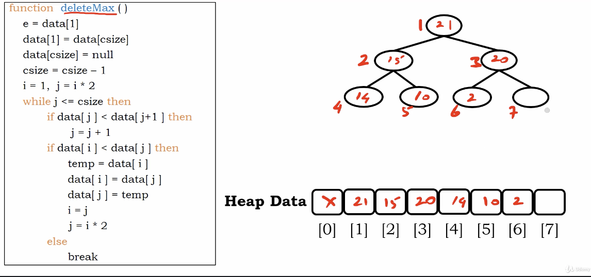
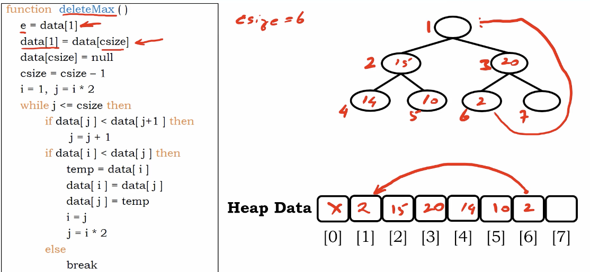
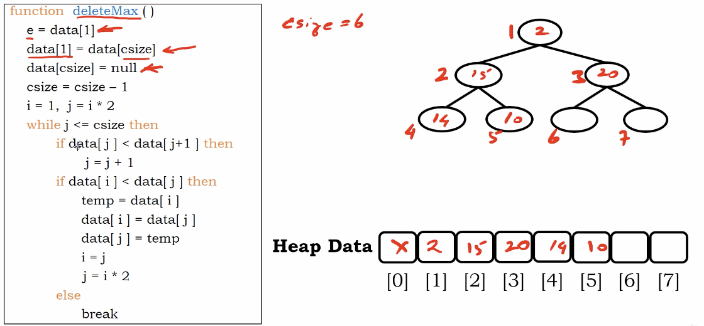
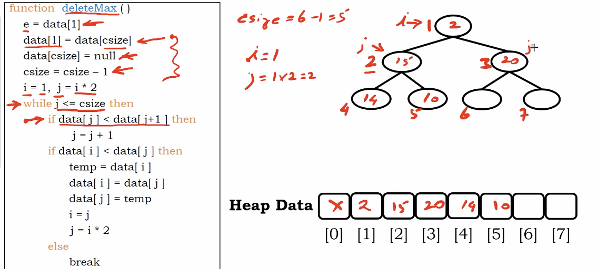
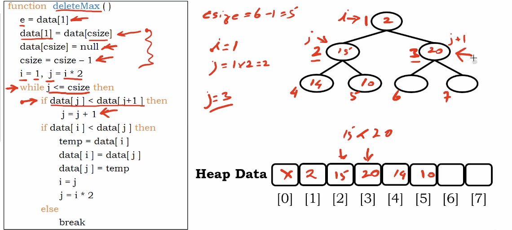
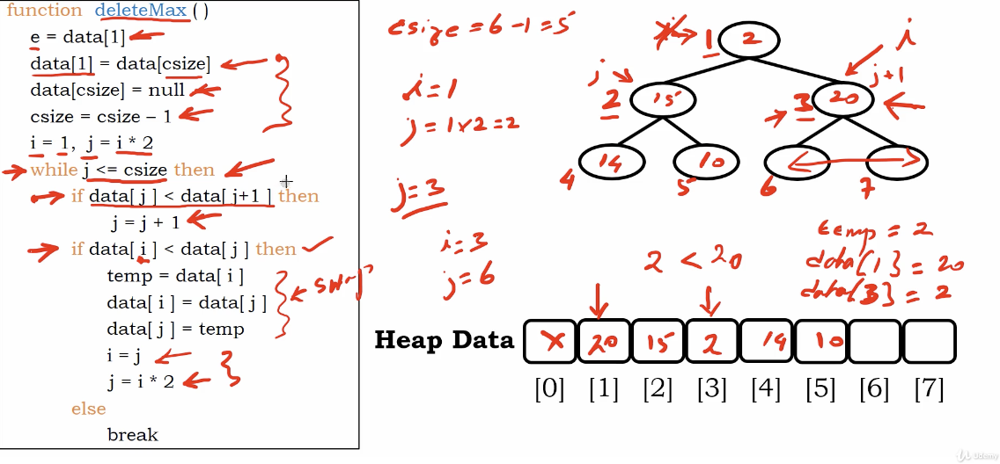

# Heap Deletion Function

# Example

We start a heap store in a array. For convinience, there is no element in index 0.

We perform `deleteMax()`

csize : current_size

</img>

perform deletion, swap last element into root, make our structure is still compelete bunary tree .
</img>

 `data[current_size] = null # delete last element`

 `curr_size -= 1`

</img>

i -> parent node
j -> child node

the while loop part perform down heap bubbling.

``` Python
if data[j] < data[j+1] then
   j+=1 
   # this line is compare the neighbor,
   # if the neighbor is bigger. it's will be a swapping candidate.
```

</img>

In this case, neighbor 20 is greater than 15. so j will assign to 3

</img>

``` Python
if data[i] < data[j] then
   temp = data[i]
   data[i] = data[j]
   data[j] = temp
   i = j
   j *= 2
   # this part perform down heap bubbling
   # and move j to the child.
```

</img>

Finally the while loop break due to the $j$ index is greater than the curr_size(means index $j$ is pointing null)

# Algorithm

``` Python
Algorithm delete_max()
   # delete root element
   # heap store in a array-like data structure
   e = data[1]
   data[1] = data[curr_size]
   data[curr_size] = null
   curr_size -= 1
   # i holds parent node, j holds child node
   i = 1
   j = i * 2
   # perform down heap bubbling
   while j < curr_size then
       # compare the child node and its neighbor first
       if data[j] < data[j+1] then
           j += 1
       if data[i] < data[j] then
       # compare the parent node and child node
       # then do swap(which is down heap bubbling)
       # and move j to the child node
          temp = data[i]
          data[i] = data[j]
          data[j] = temp
          i = j
          j *= 2
       else
          break           
```
