# Heasp Sort

1. Use Heaps data structure
2. Insert elements in the heap
3. Perform deletion until heap is empty
4. Stor deleted elemenys from the heap back into the array

# Example

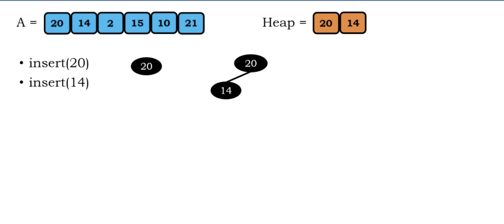</img>
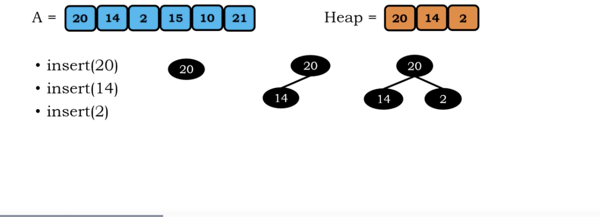</img>
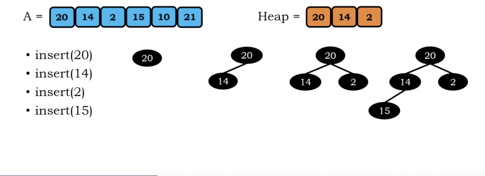</img>

perform up heap bubbling

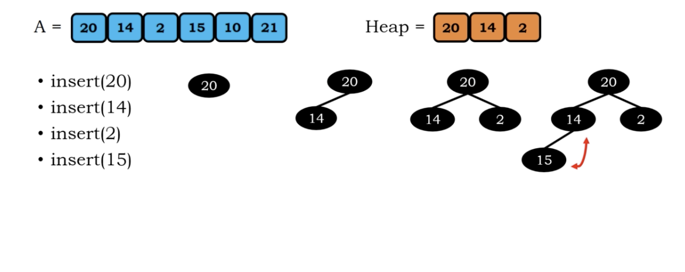</img>

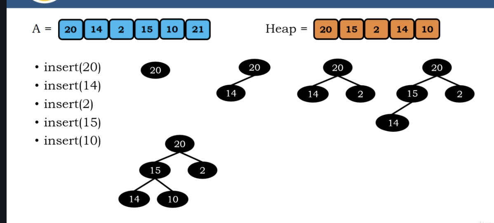</img>
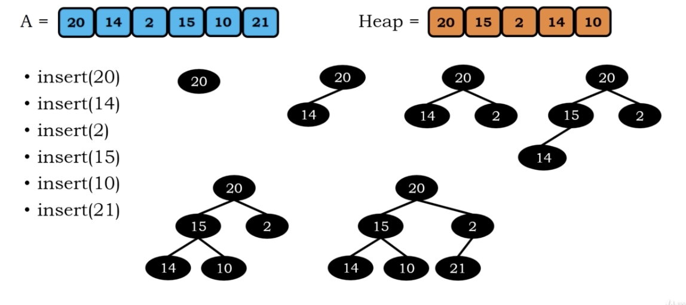</img>

perform up heap bubbling

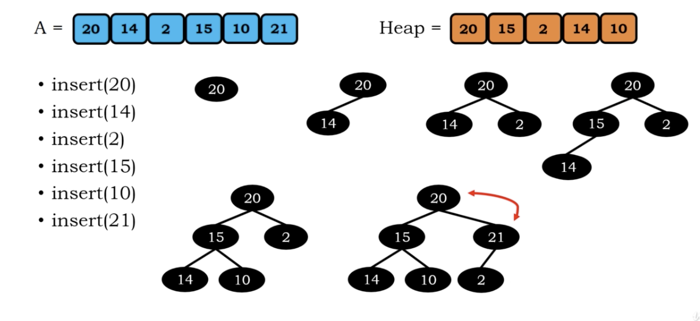</img>

`deleteMax()` , and down heap bubbling

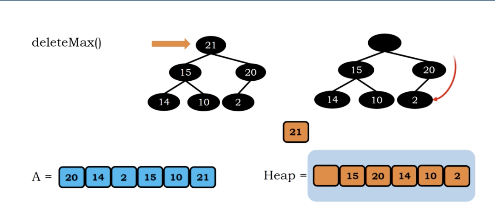</img>
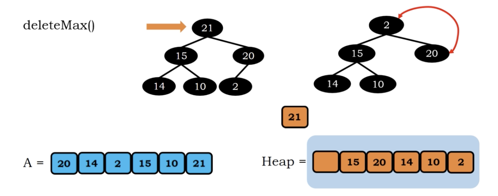</img>
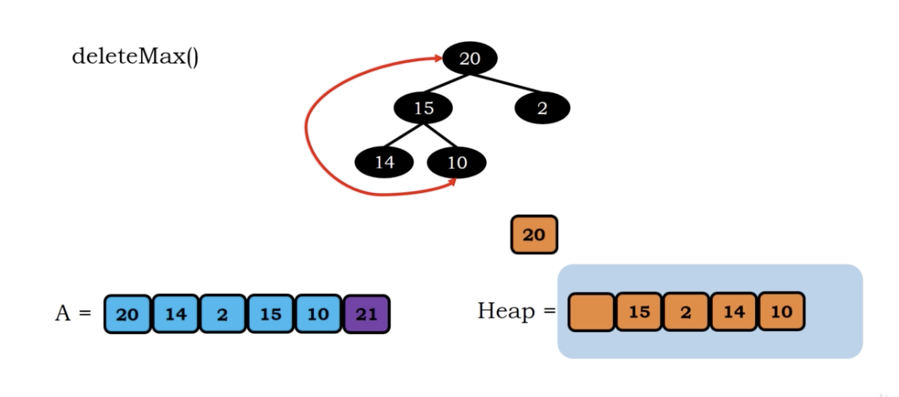</img>
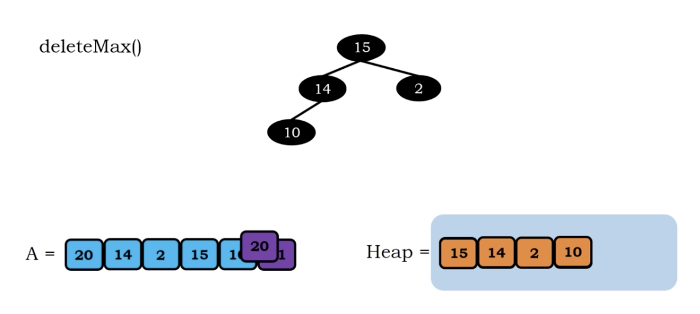</img>
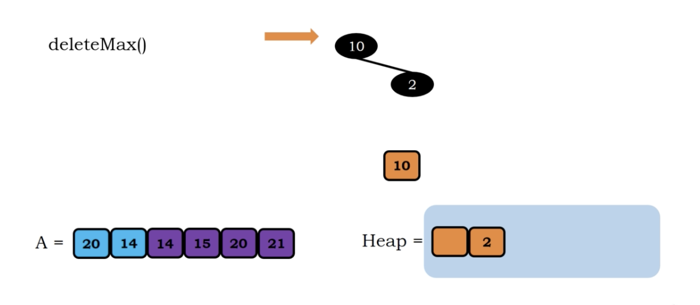</img>
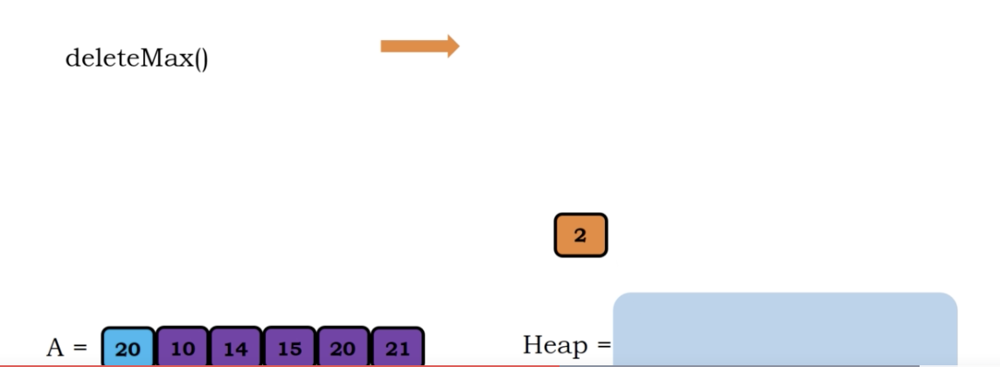</img>
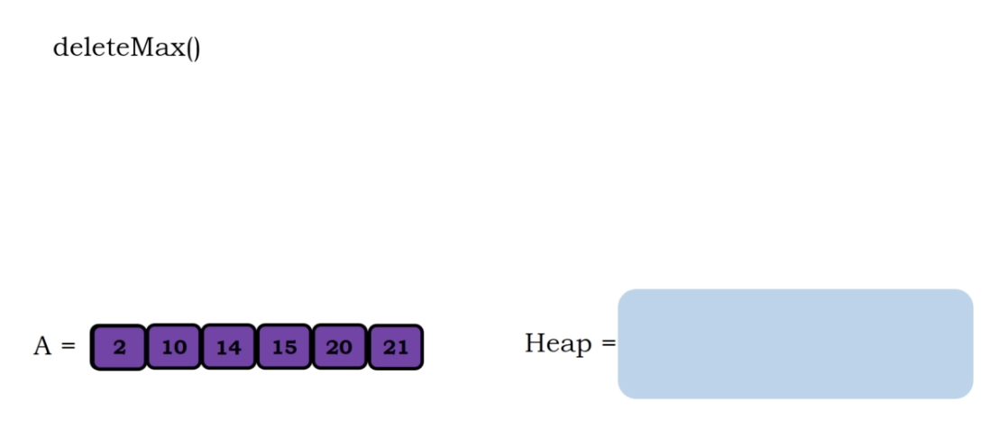</img>

# Algorithm

``` Python
Algorithm heapsort(A)
   H = heap()
   n = legnth(A)
   for i=0, i < n, i++
     H.insert(A[i])
   
   k = n-1
   for i=0, i < H.current_size, i++
      A[k] = H.deletemax()
      k = k - 1

```

# Complexity

heap.insert -> $O(log n)$, for all items, -> $O(n logn)$

deletion ->  O(logn), for all items, O(n log n) (the n decrease)

Overall, the worst case ->

Time :  $O(n log n)$

Space : $O(n)$
