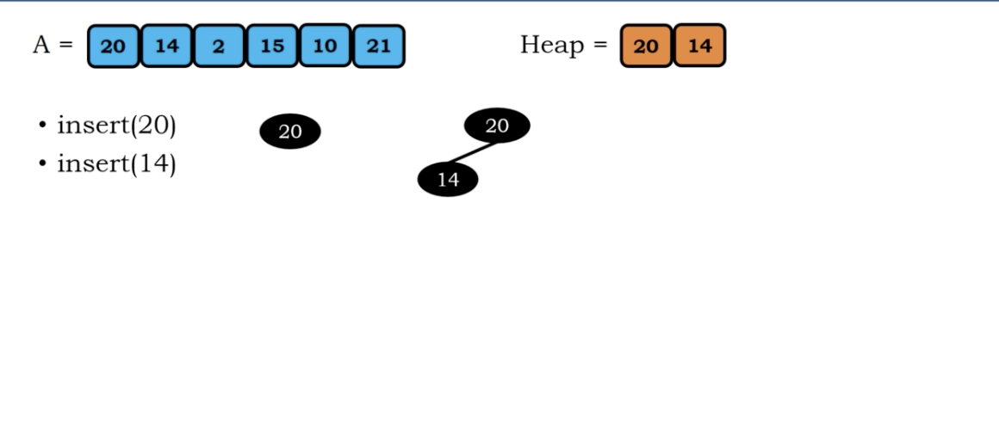
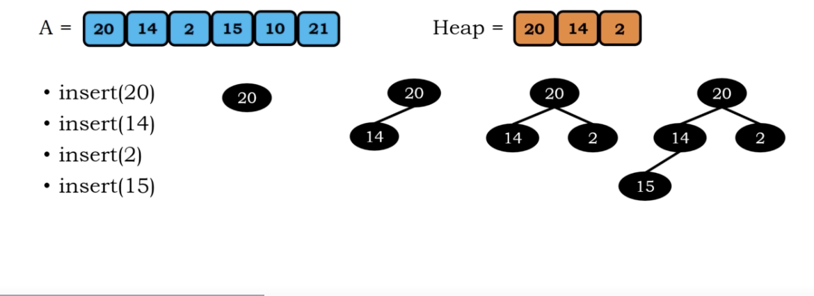

# Hashing

</img>

$O(h)$ means height

# Ideal Hashing

</img>

When performing search, we just take out the index. No need to loop over the whole list

Here we are considering 1 to 1 mapping.

the hash function is 

$h(x) = x$

This hash function as known as ideal hashing.

# Compression Hashing

In the ideal hashing, the space complexity is $H(m)$, where m is the maximum number of array.

Consider 

$h(x) = x~\%~10$

Space complexity : $O(1)$

</img>

# Collision

</img>

</img>

There are some ways to dealing with collision.
