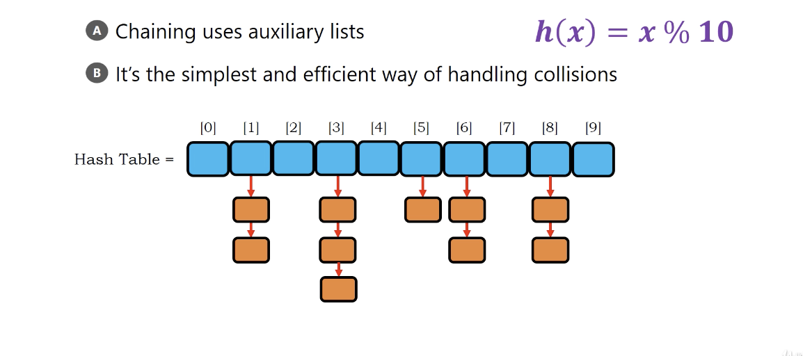
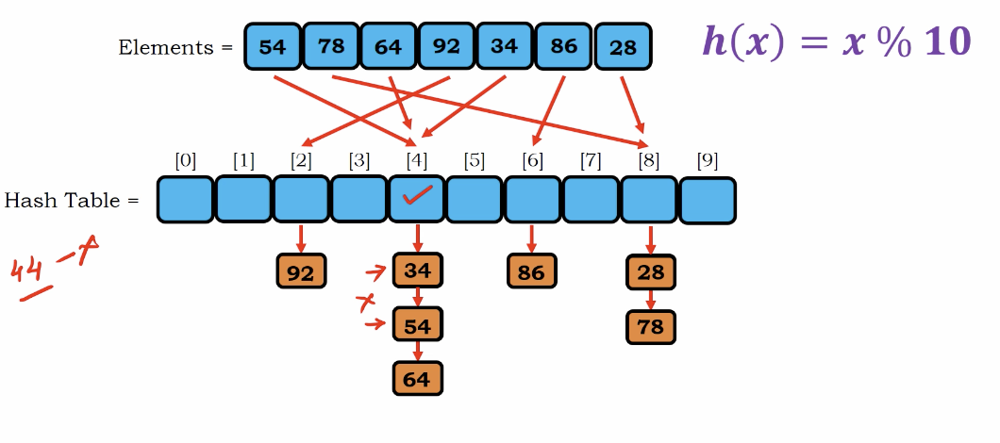

# Chaining

</img>
</img>

Basically a list contains list in each element in Python.

Complexity

$n$ elements with $s$ buckets

Suppose the element is uniformed distributed.

the average loading $\frac{n}{s}$ - load factor

Time complexity : $O(\frac{n}{s})$

the buckets $s$ is corresbonding to your hash function and your hash table size.

if we perform a over-allocated style of hash table, the time complexity is almost 

$O(\frac{n}{s}) \rightarrow 1$

Space complexity

$O(s)$

if we want fast searching.

$O(\frac{n}{s}) \rightarrow n$
