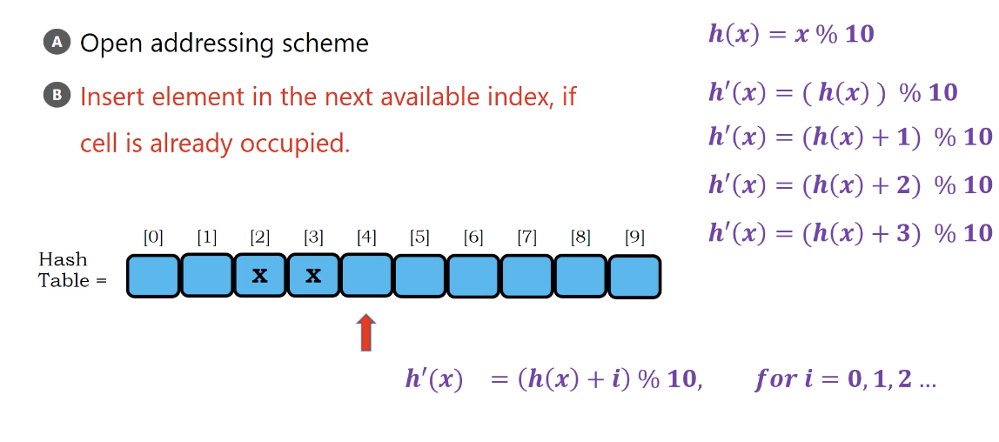
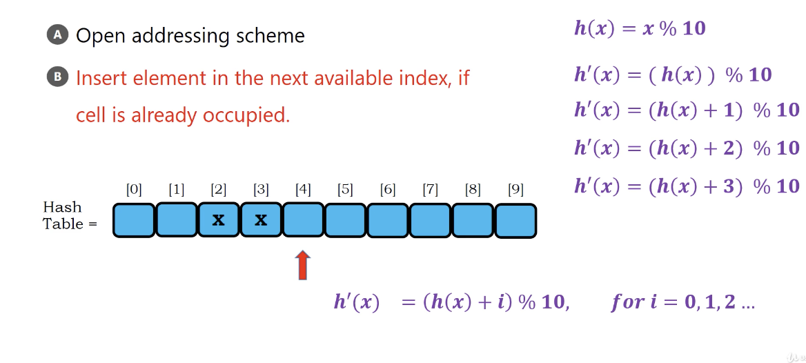
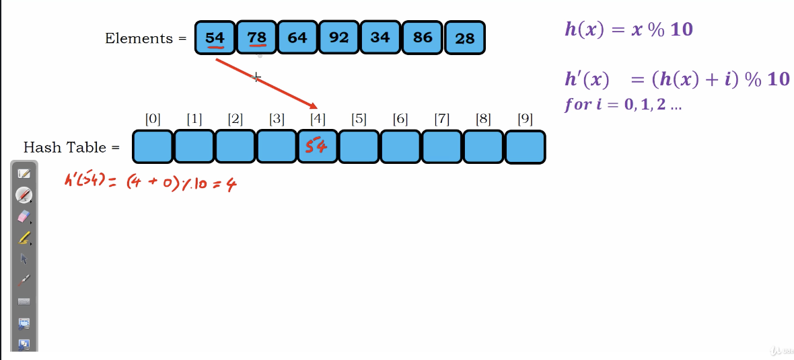
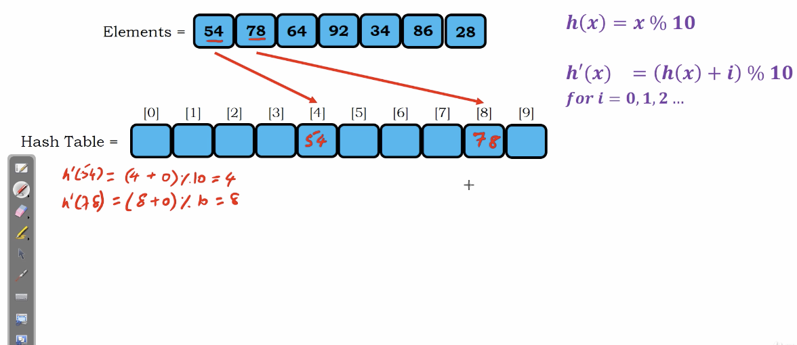
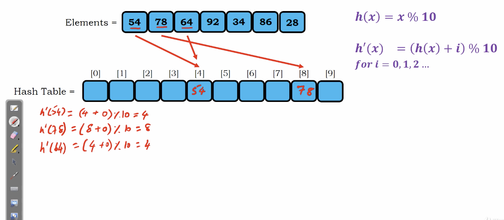
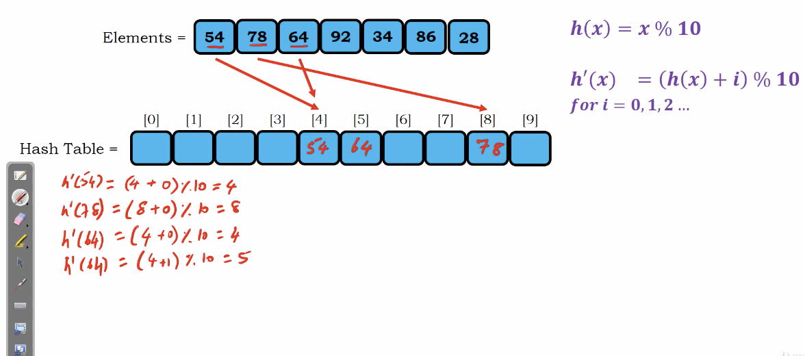
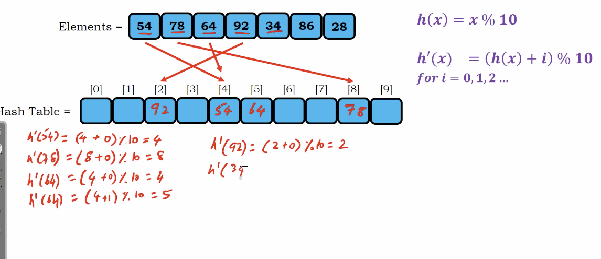
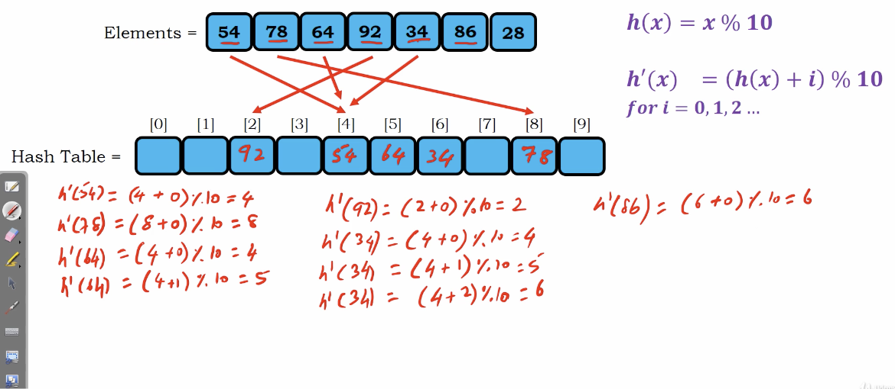

# Linear Probing

A way to avoid collision

By simply : 

Insert element in the next avaialbe index, if cell is already occupied.

</img>
</img>

Our hash function is 

$$
h'(x) = (h(x) + i) \% 10, ~~ for~~ i = 0, 1, 2, 3, ...
$$

# Example

</img>

</img>

</img>

</img>

As you see, the 64 due to the collision, we put it into bucket `5`

</img>

</img>

# How to perform searching?

Same hash function when we put in. 
If found, seccessful, If not, search for the next bucket, continue to all $i$ index.
(Which is a stupid method. Because we need to search all $i$ index)

# Complexity Analysis

$N$ elements

$m$ size of hash table

Loading factor $L = \frac{m}{N} = 0.7$

$L < 1$

we can find all the element in hash table.

On average :  $O(1)$

Worst :  $O(N)$

Practical tips, $L < 0.5$
