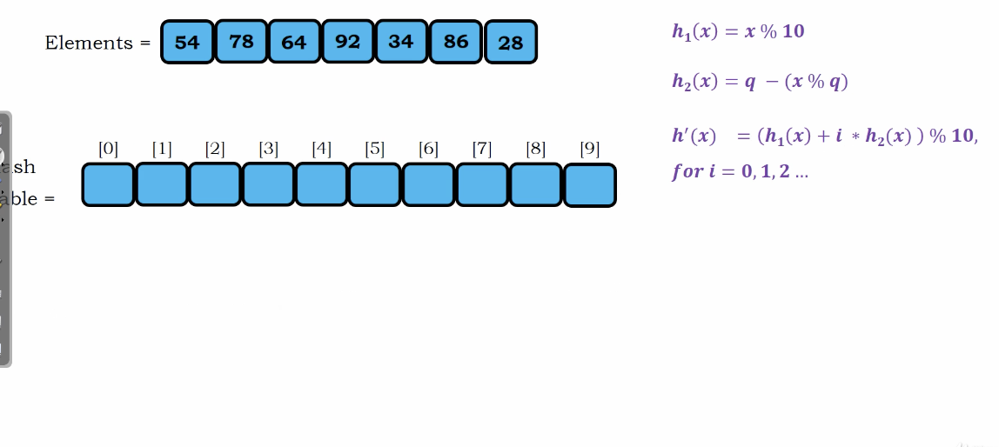
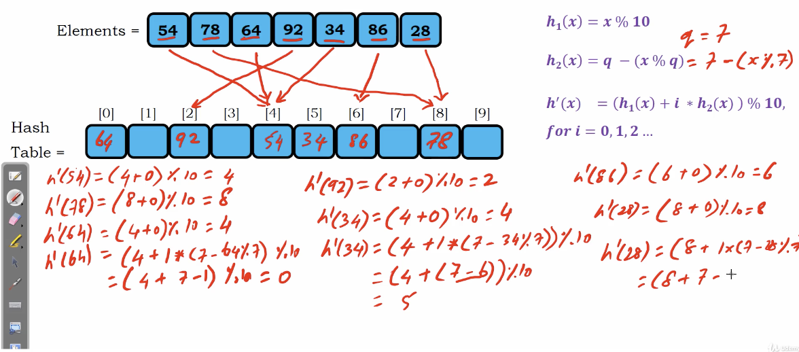

# Double Hashing

If the bucket is already occupied.

We use another hash function to get the hash code.

</img>

$h_{1}(x) = x \% 10$
$h_{2}(x) = q - (x \% q)$
where $q$ is a prime number less than the size of the hash tablr $m$

the total hash function will be

$$
h'(x) = (h_{1}(x) + i \times h_{2}(x)) \% 10 ~~ for ~~i ~~ = 0, 1, 2, 3, ...
$$

</img>

Use double hashing will not cause the cluster in hash table!
