# Bucket sort

Use the concept of hashing.

1. Hashing all elements into buckets

2. insertion sort in each bucket

3. retrieve element into a array.

## Example

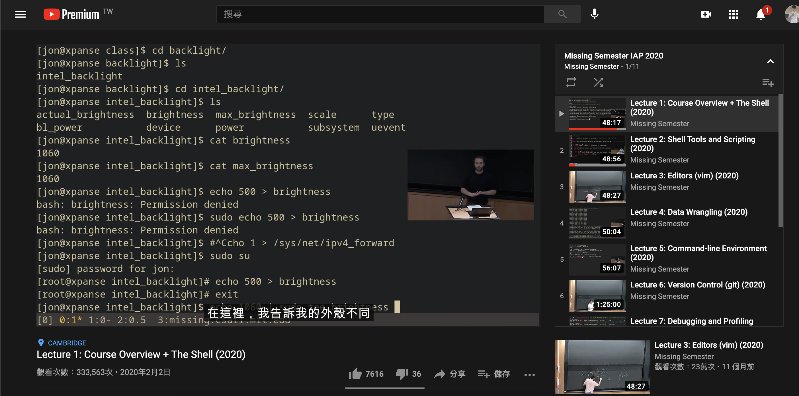</img>

floor( index = n * e / (max + 1) )

n (the number of element) = 6

max = 92

### inserting

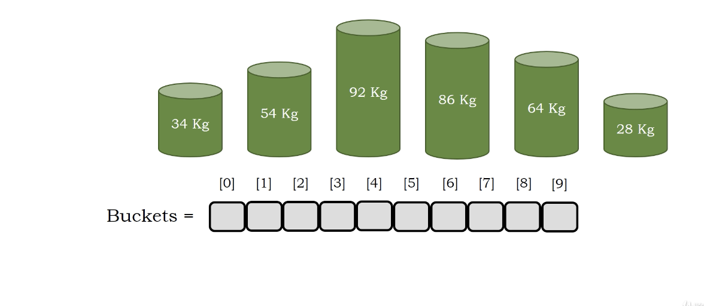</img>
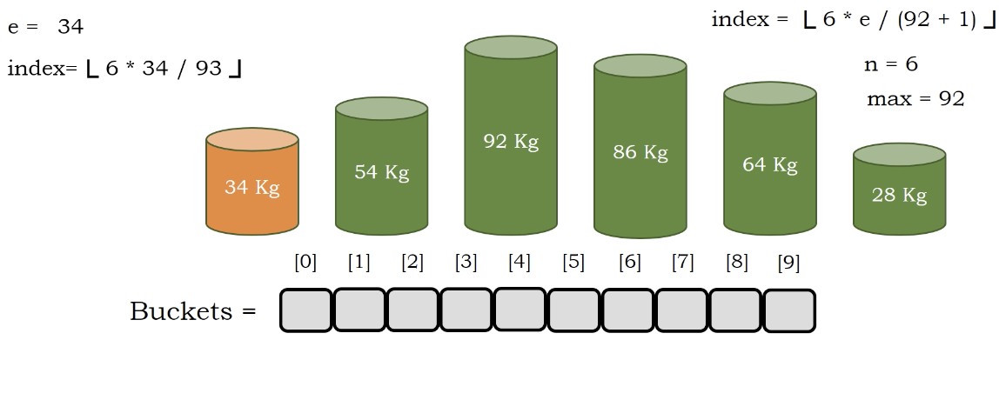</img>
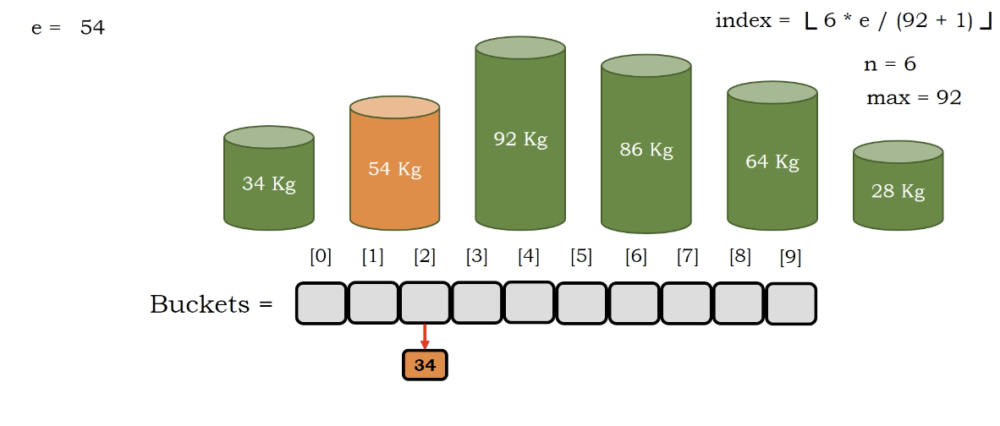</img>
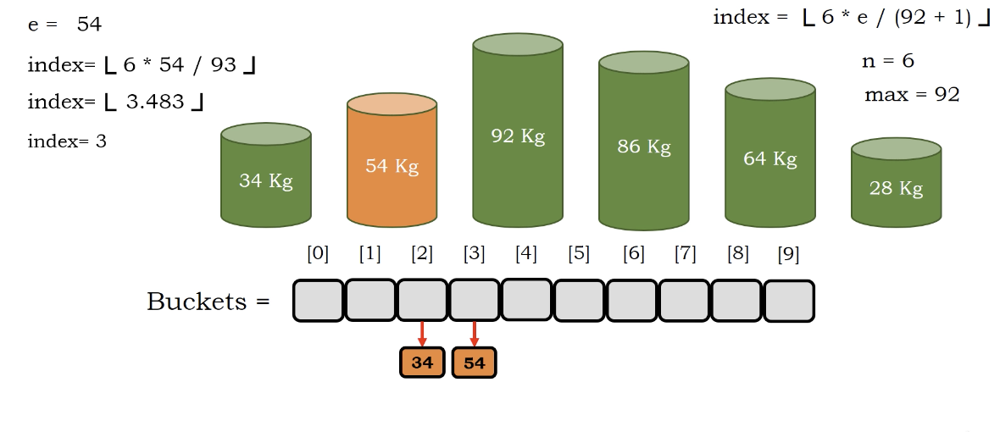</img>
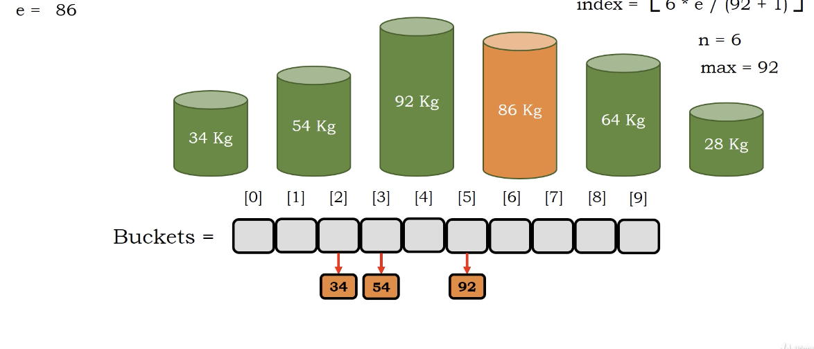</img>
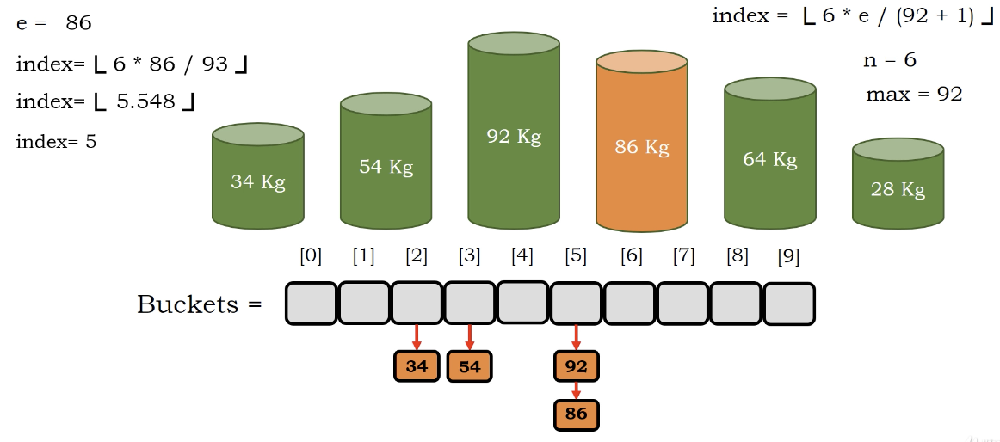</img>
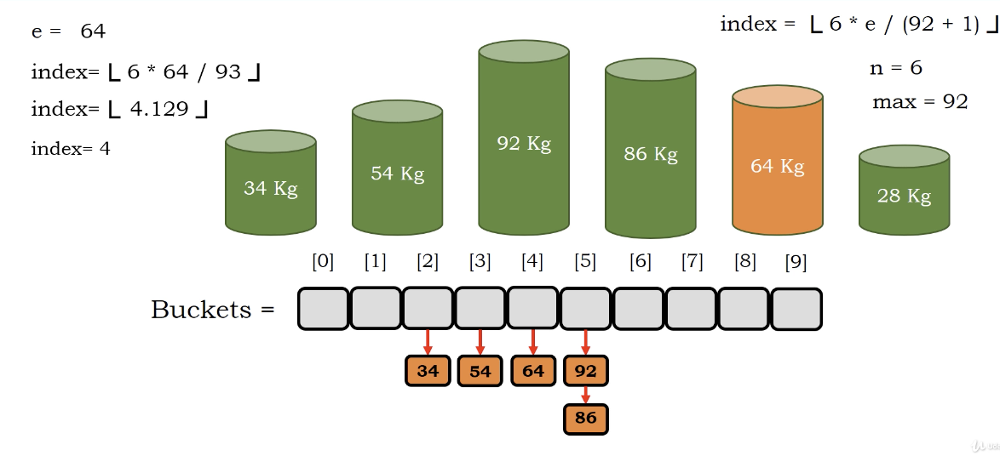</img>

### insertion sort in each bucket

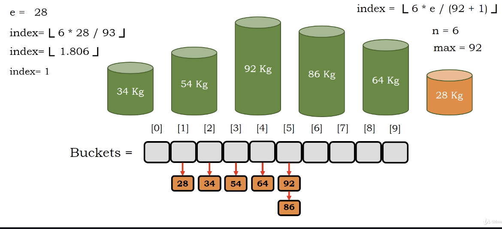</img>

### retreve element

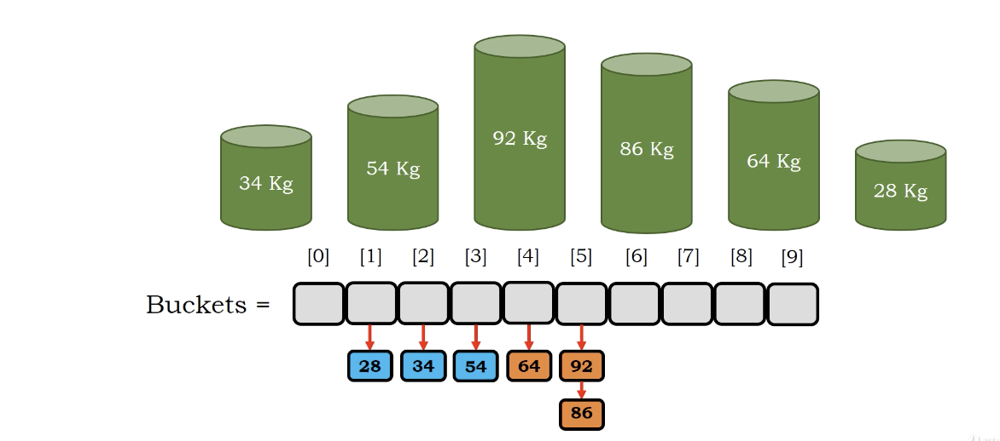</img>

# Algorithm

``` Python
Algorithm bucketsort(A)
    n = length(A)
    max = maximum(A)
    buckets = []
    for i = 0, i < n, i++
        j = n * A[i] / max + 1 # the hash function
        buckets[j] = A[i] # link them?
    for i = 0, i < 10, i++
        inserttionsort(buckets[i])
    k = 0
    for i = 0, i < 10, i++
        A[k] = bucket[i].remove()
        k = k + 1
```

# Complexity Analysis

1. assign to bucket $O(N)$
2. insertion sort $O(m^{2})$, m is the element counts in the bucket
3. Note that the insertion sort part can be parallelized to each bucket.

Space Complexity : $O(n k)$ 

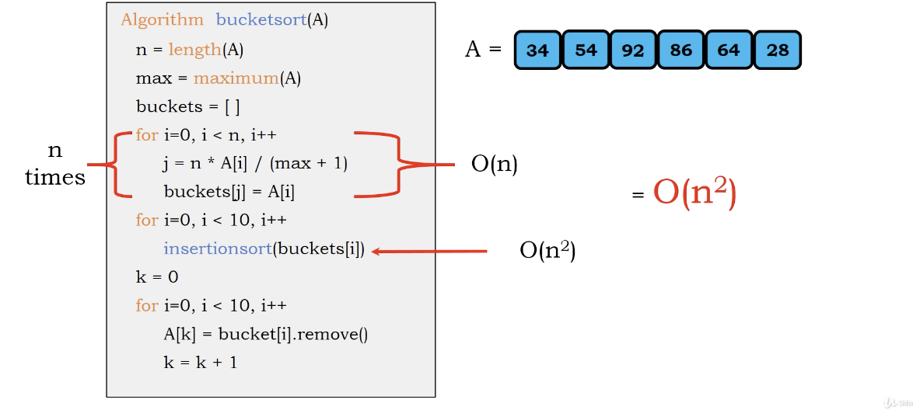</img>

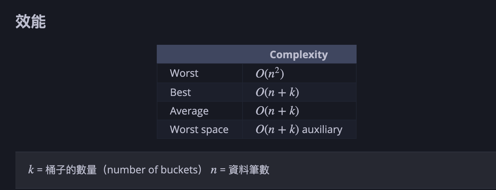</img>

# Reference

[Rust Algorithm Club](https://rust-algo.club/sorting/bucket_sort/)

[tutorials point](https://www.tutorialspoint.com/Bucket-Sort)
