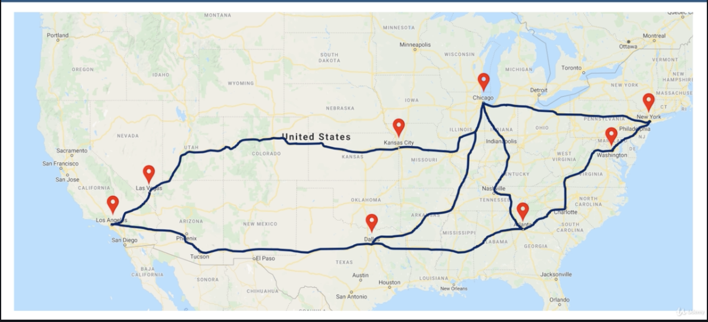
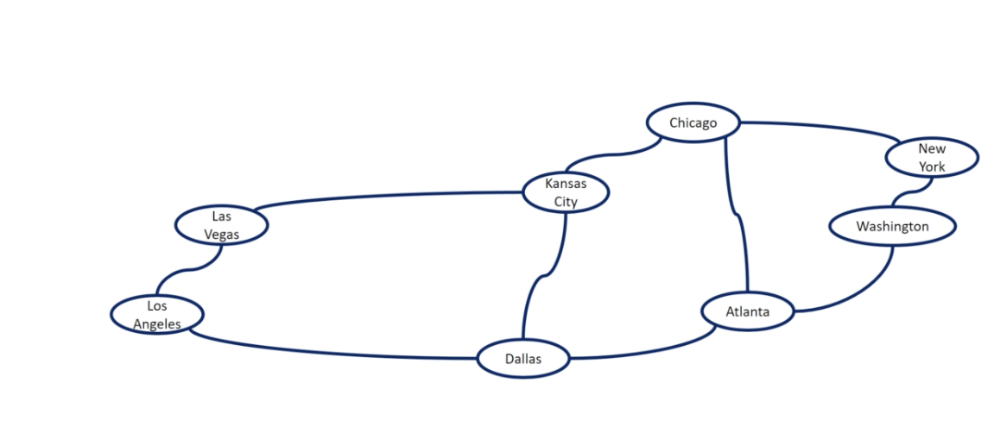
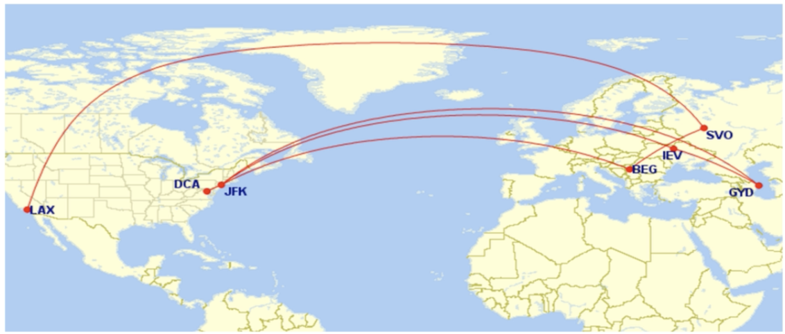
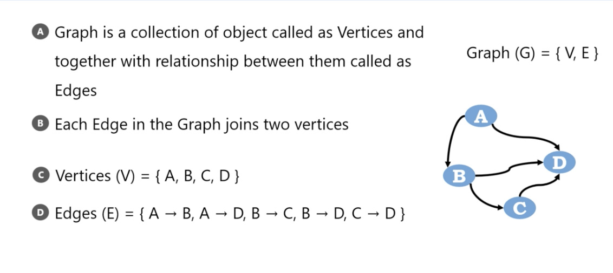
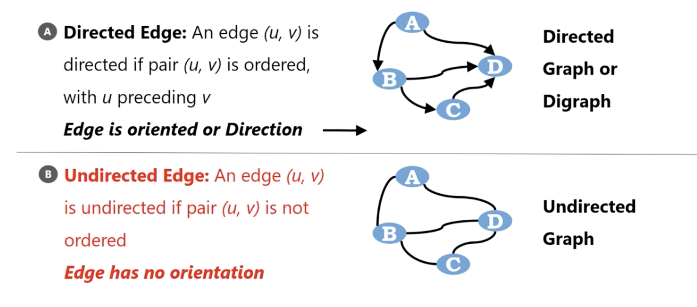
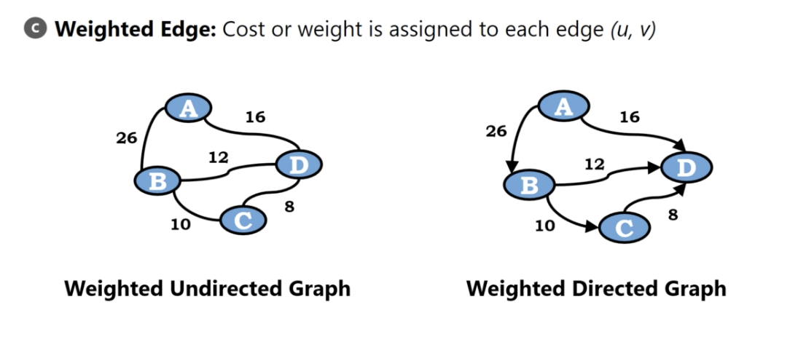
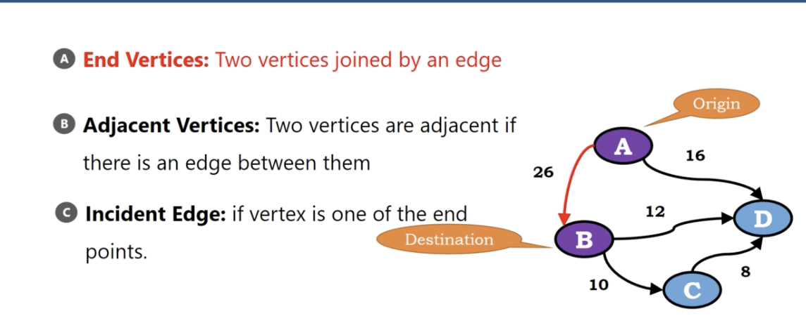
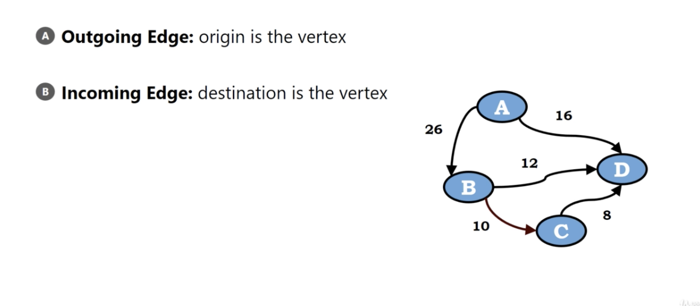
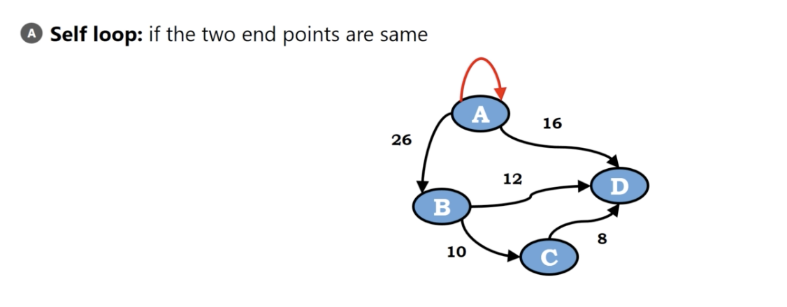
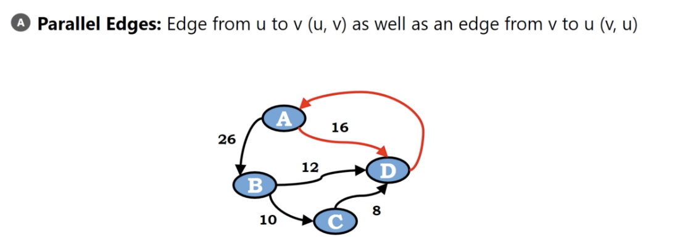

# What are graphs?

01. Graphs represents relationship between objects
02. Collection of objects along with pairwise connection between objects

</img>

Consider cities are objects
pairwise connection represents the road between cities.

# Another Examples

node : cities
connection : flight path

</img>

the node in graphs we call it **vertex**(頂點)
the connection in graphs we call it **edges**(頂點)

</img>

# Graph Data Structure

1. A collection of objects as Vertices(node) and together with relationship between them called as Edges.

Graph $G = \{V, E\}$

02. Each Edge in the Graph joins two vertices.
3. Vertices $(V) = \{A, B, C, D\}$
4. Edges $(E) = \{ A \rightarrow B, A \rightarrow D, B \rightarrow C, C \rightarrow D   \}$

</img>

# Graph Terminology

01. Directed Edge
02. Undirected Edge

</img> 

03. Weighted Edge

</img>

4. End Vertices : Two vertices joined by an edge. Like$A \rightarrow B$, $A, B$ are end vertices, like a origin and destination pair.

</img>

5. Adjacent Vertices(鄰近頂點) : Two vertices are adjacent if there is an edge between them. Like $(A, B)$, $A, D$, $B, C$ but not $A, C$

6. Incident Edge(死路) : If vertex is one of the end points. like the edge $A \rightarrow D$, but not $B \rightarrow C$

07. Outgoing Edge : origin is the vertex
08. Incoming Edge : destination is the vertex

</img>

09. self loop : if the two end points are same

</img>

10. Parallel Edges : Edge from $u$ to $v$ as well as an edge from $v$ to $u$

</img>
