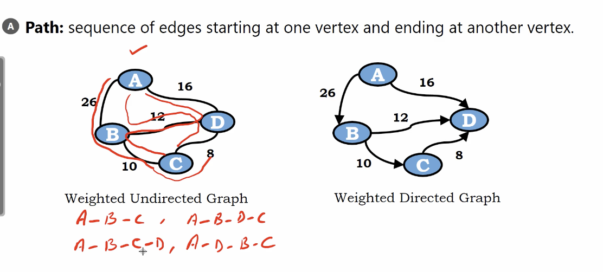
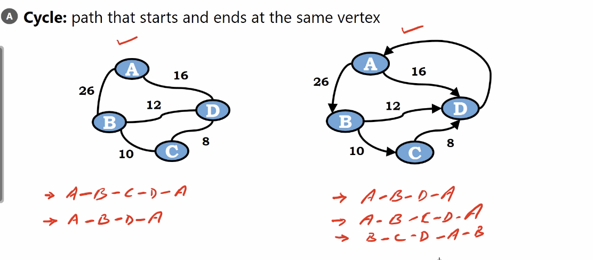
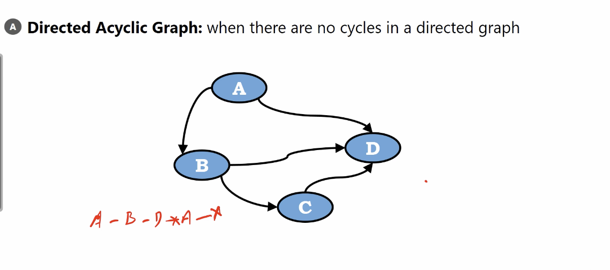

# Path

## Undirected Graph

</img>

## Directed Graph

</img>

we can't plan a path $A \rightarrow D \rightarrow C$

Because there is no edge $D \rightarrow D$

# Cycle

destination is the same as source

</img>

# Directed Acyclic Graph

有向無環圖 (tensorflow computational graph, airflow graph)

</img>
