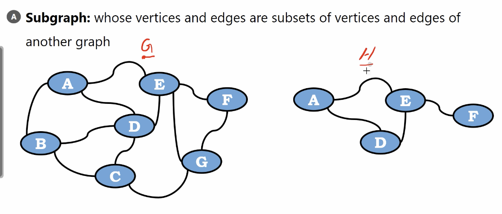
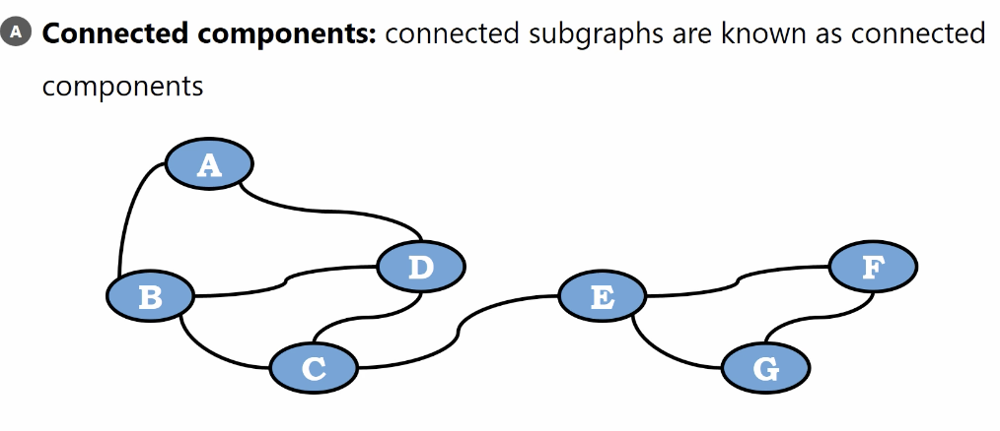
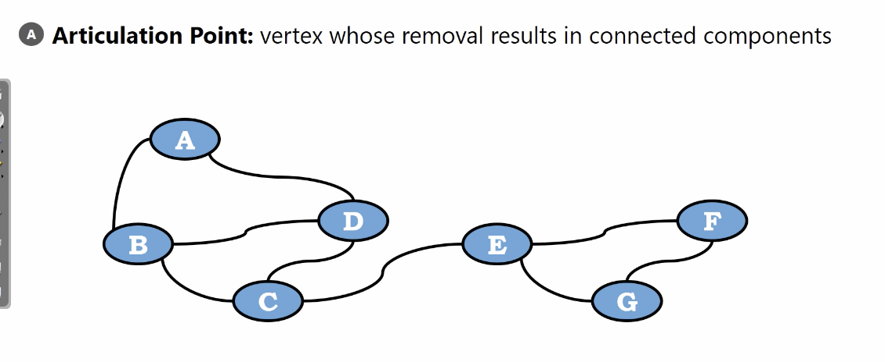
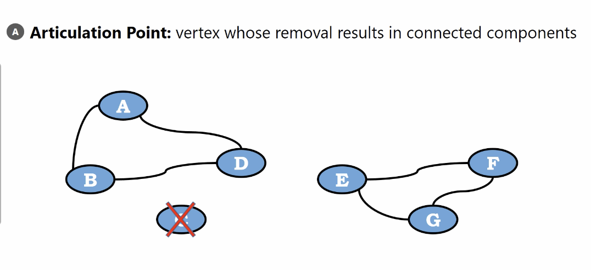
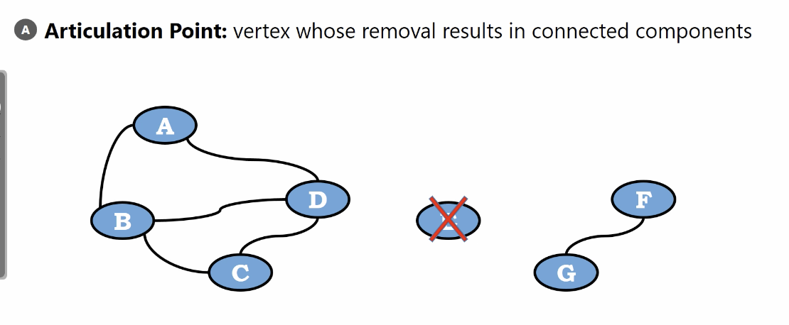
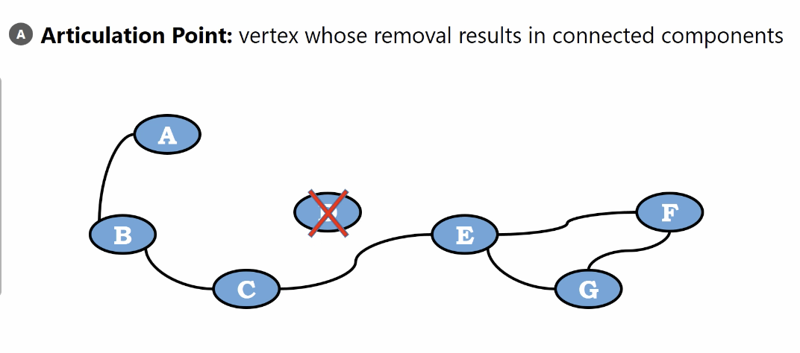
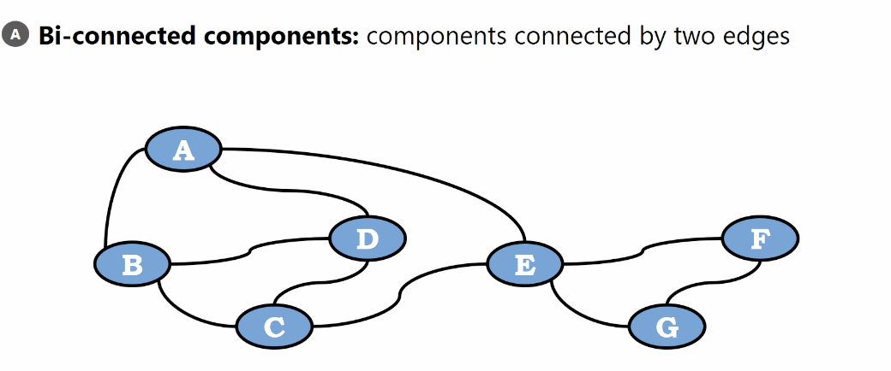
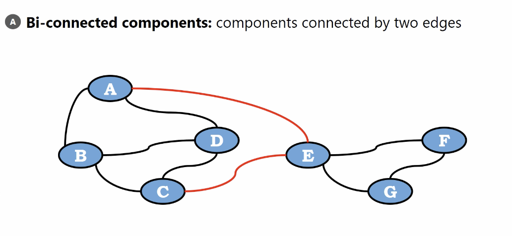
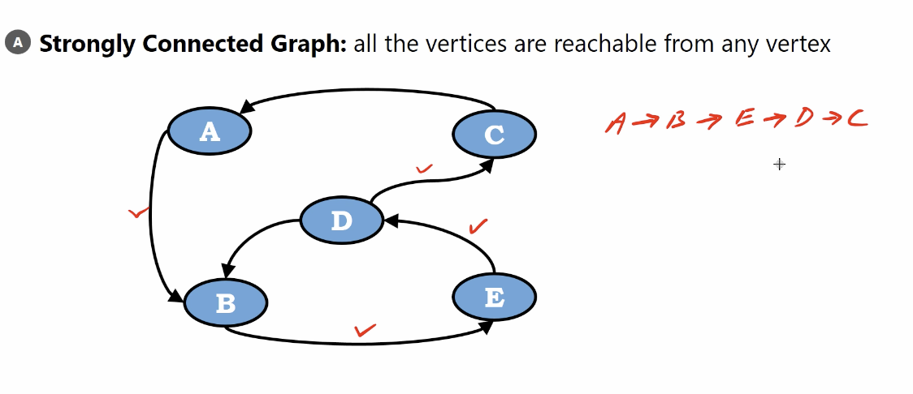

# Subgraph

Whose vertices and edges are subsets of vertices and edges of another graph.

</img>

# Connected components

the vertex connected subgraph are known as connected components

</img>

subgraph $G$(left) and subgraph $H$(right)

# Articulation Point

</img>
</img>
</img>
</img>

the vertex whose removal in connected components

$C$ and $E$ are articulation points

$D$ is not an articulation points

# Bi-connected components

components connected by two edges

</img>

</img>

* If we remove an edge in vertex $E$, the graph still safe, doesn't split into two subgraphs.

# Strongly Connected Graph

all the vertices are reachable from any vertex.

</img>
