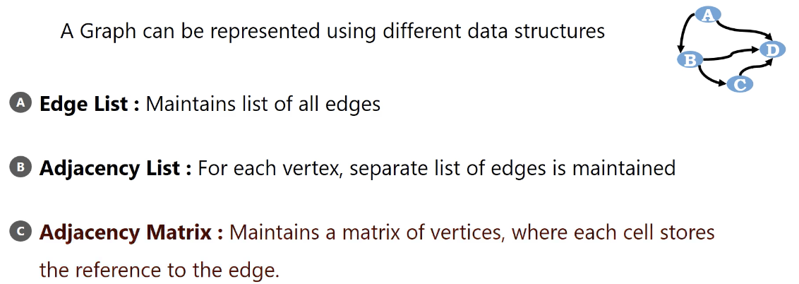

# Graphs Representation

</img>

Edge List : simplest representation, but there is no efficient way to find a particular edge or set of edges on a vertex.

Adjacency List : more efficient since all the edges can be easily accessed and we can efficiently find all the edges incident to a vertex.

Adjancency Matrix : most common in deep learning. Since it's a matrix representation and some mathematical property can be played with.
