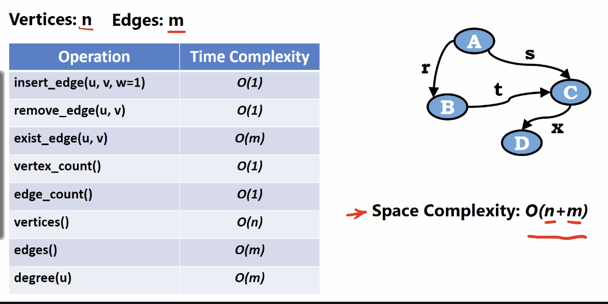

# Edge list

</img>

We use two lists.

And using linked list data structure to implement.

# Example

</img>
</img>
</img>

# Complexity Analysis

</img>

The limitation of using this data structure : 

finding existing edge, computing edges and computing degree of certain vertex.
