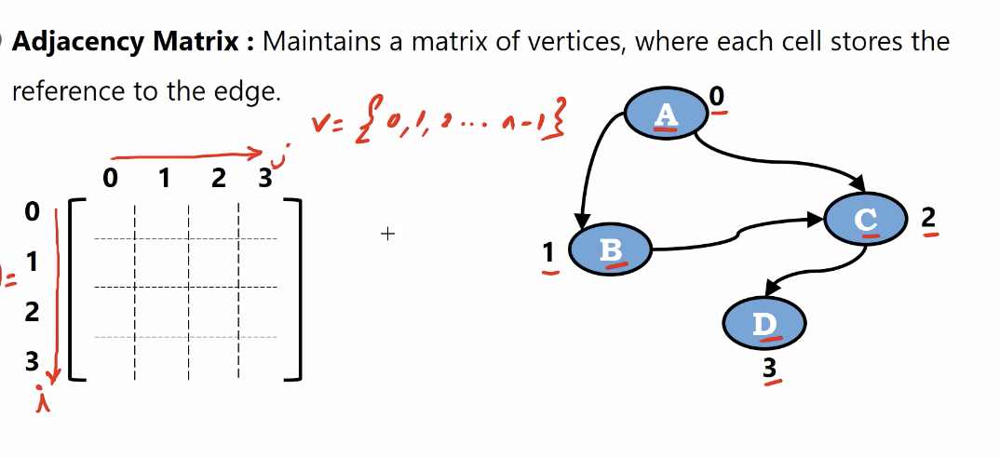
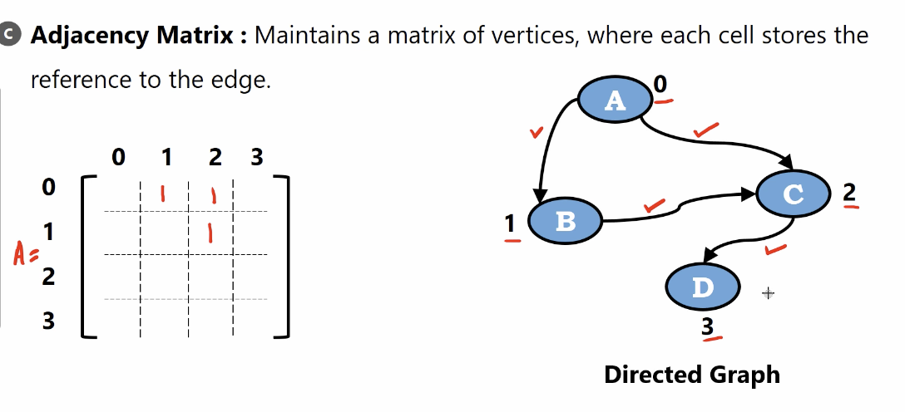
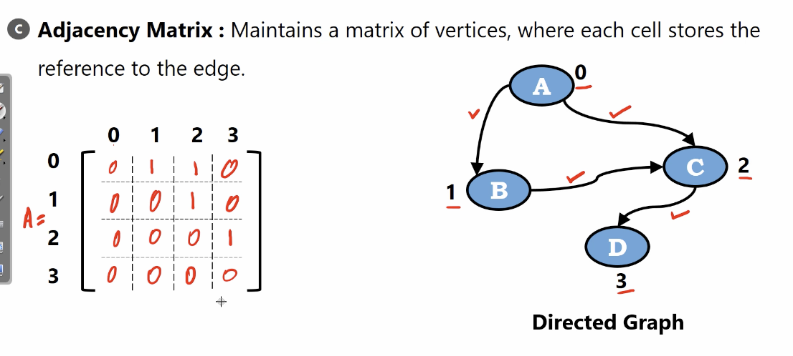
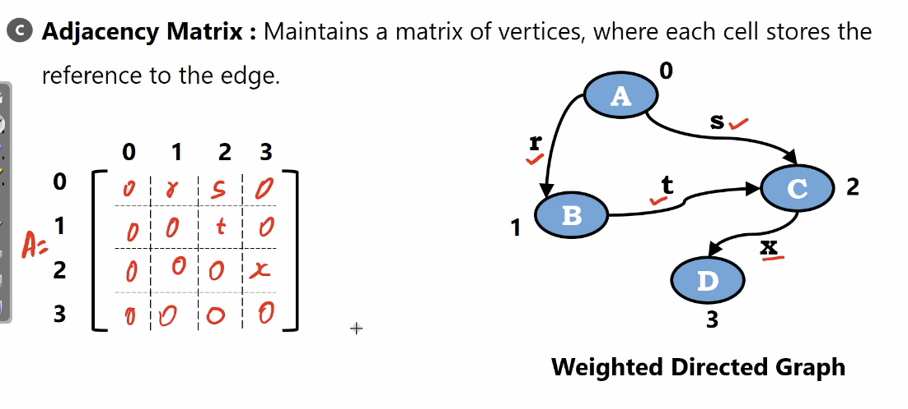
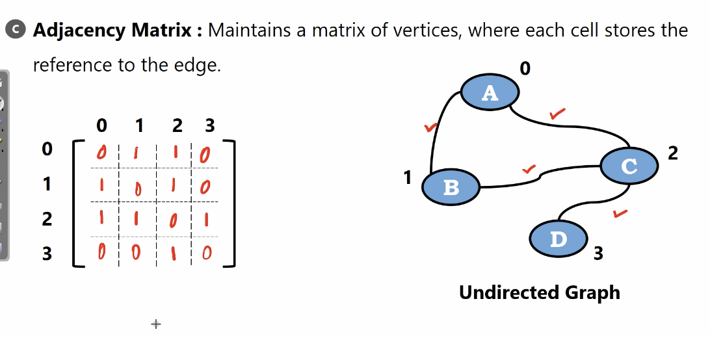
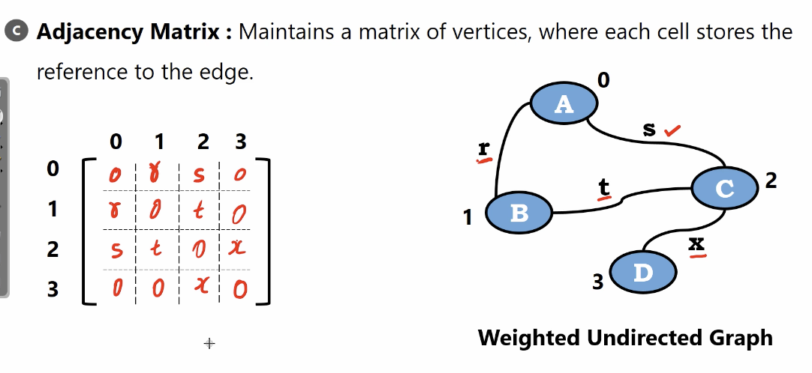
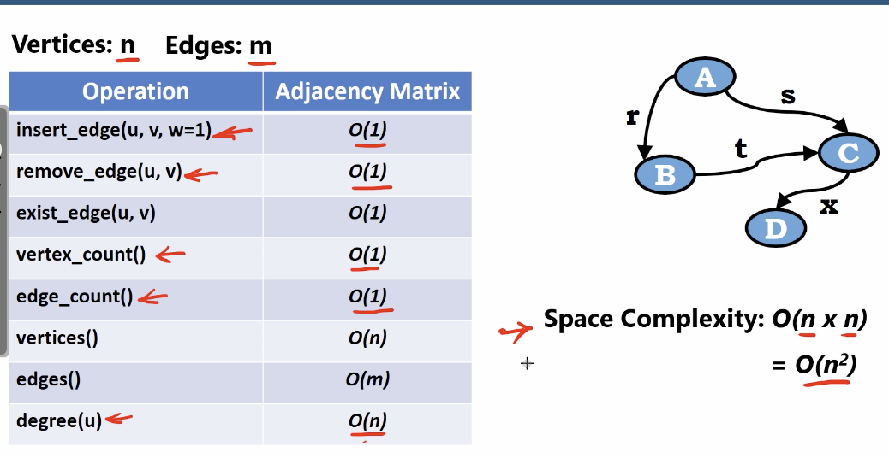

# Adjacency Matrix

Maintains a matrix of vertices, where each cell stores the reference to the edge.

$V = \{0, 1, 2, 3, ..., n-1\}$

</img>

The element $i, j$ in $A$ which is $A_{i, j}$

$A_{i, j}$ represent is there a edge exist or not.

## Directed Graph

</img>

$A_{0, 1}$ -> is there a edge $A \rightarrow B$ ? Yes

$A_{0, 2}$ -> is there a edge $A \rightarrow C$ ? Yes

$A_{1, 2}$ -> is there a edge $B \rightarrow C$ ? Yes

</img>

As you see, If the connection isn't a lot.

We have a sparse matrix!

## Weighted Directed Graph

</img>

Just put the weights on.

## Undirected Graph

Since it's a undirected graph.

We have a sysmmetric matrix.(There is a lot of math tools can be use!)

</img>

Like factorization technique!

## Weighted Undirected Graph

</img>

# Performance

</img>
