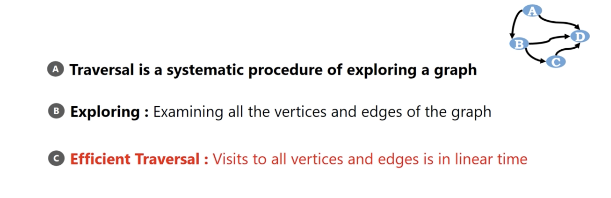

# Graph Traverse

Graph is a non-linear data structure. So we can't apply linear traverse technique to graph.

</img>

# Graph Traversals for Graph

1. computing a (directed or not)path from a to b
2. compute path to reach all other vertices
3. find whether a graph is connected
4. computing connected component of the graph.
5. computing cycle(acyclic) in a graph
6. computing spanning tree of the graph.

# Breadth-First Search / Depth-First Search

Two ways to traverse a graph.
