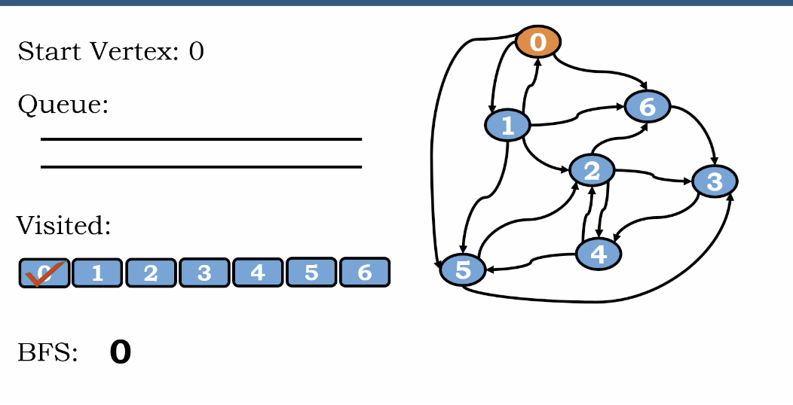
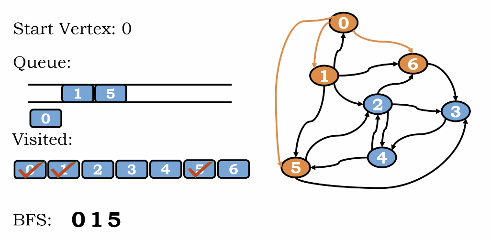

# Breadth First Search(BFS)

1. subdivides the vertices into levels and proceeds in rounds.
2. starts at a vertex, which is considerd at level 0
3. identitifies all the vertices reachable from starts vetex at level 1, marks them visited.
4. round += 1 
5. repeat 2 to 4

# Example

</img>
</img>

BFS 

0, 1, 5, 6 (level 1)

2, 3 (level 2)

4 (level 3)

The explore path may be different by different start vertex.

## Another Scenerio

0, 1, 5, 6 (level 1) -> 0, 1, 6, 5

</img>

## Algorithm Example

visited 0 at level 0

</img>

enqueue 0 into the queue(level 0)

</img>

deque level 0

</img>

out path of 0 - enqueue 1 into Queue(level 1)

</img>

Start to explore the out path of 0

out path of 0 - enqueue 5 into the queue(level 1)

</img>

out path of 0 - enqueue 6 into the queue(level 1)

</img>

deque 1 at level 1

</img>

Start to explore the out path of 1

5 and 6 is already visited!

out path of 1 - enqueue 2 into the queue(level 2)

</img>

deque 5 at level 1

Start to explore the out path of 5

2 is already visited!

out path of 5 - enqueue 3 into the queue(level 1)

</img>

deque 6 at level 1

</img>

Start to explore the out path of 6

</img>

No any witness exist for 6

</img>

deque 2 at level 2

Start to explore the out path of 2

</img>

enque 4 into the queue.

</img>

No witness exist for 2

deque 3 

Start to explore the out path of 3

</img>

deque 4 

Start to explore the out path of 4

</img>

## Algorithm

``` Python
Algorithm BFS(s)
    # s is the start vertex
    i = s, q = Queue(), visited [] = [0,0,0......n-1]
    print(i) # print the start vertex
    visited[i] = 1 # mark the start vetex as vistied
    q.enqueue(i) # enqueue the start vextex for exploration
    while ! q.is_empty() then
        i = q.dequeue() # means we are focus on exploring the out path of vetex i
        for (j = 0, j < n, j++)
            if adjmat[i][j] == 1 && visited[j] == 0 then # check is there a edge and still not visited of out path vetex i
                print(j) # get the visited vetex
                visited[j] = 1
                q.enqueue(j)
```

1. BFS is similar with level-order tree search, we use queue for un explored node at the same level.
2. all the element in the visited will be initialized to zero

# Time Complexity and Space Complexity
