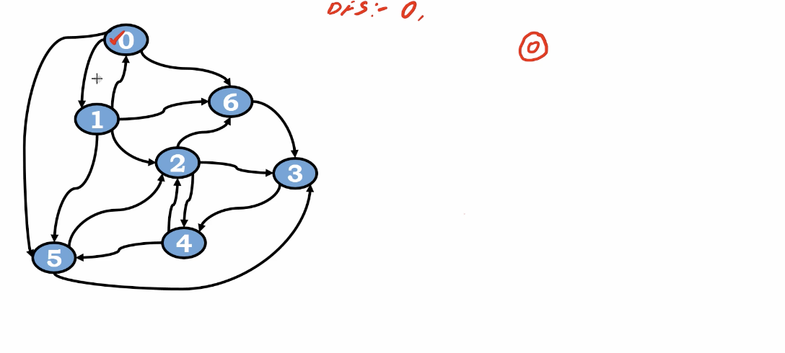
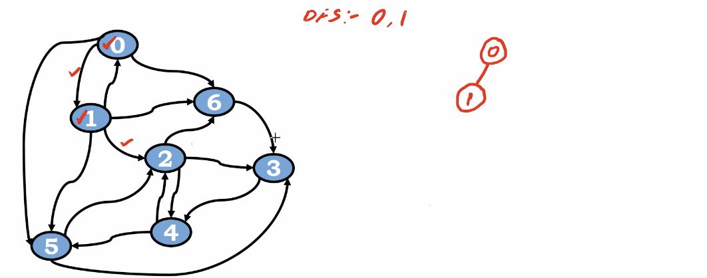
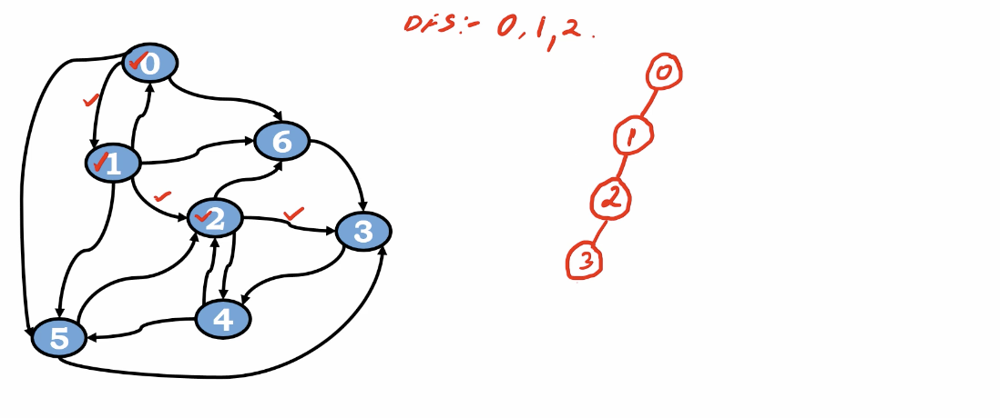
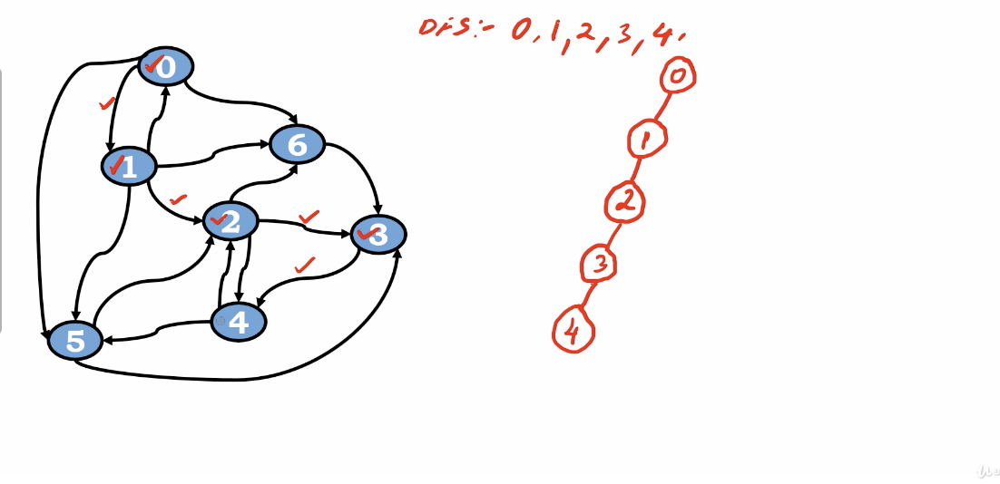
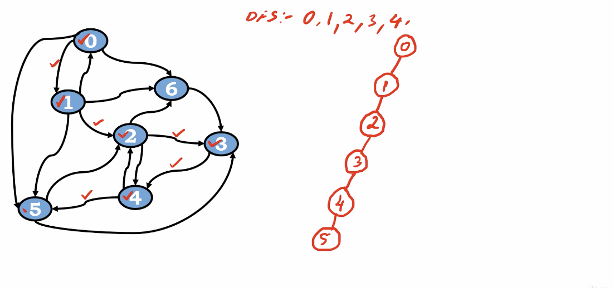
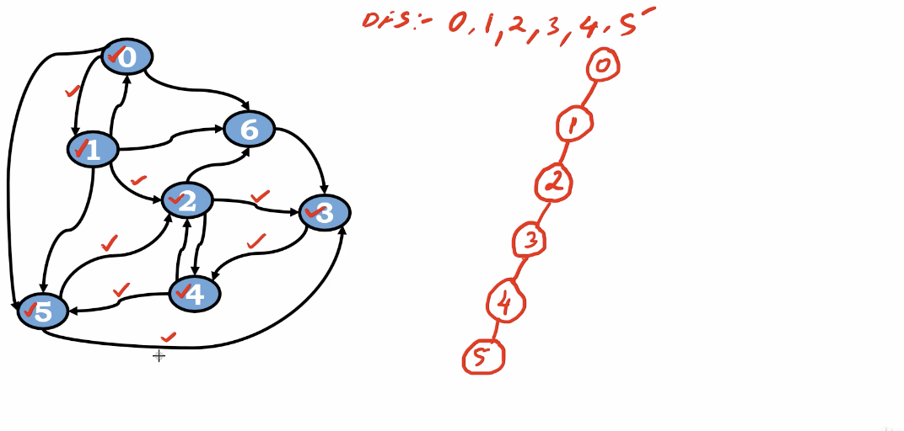
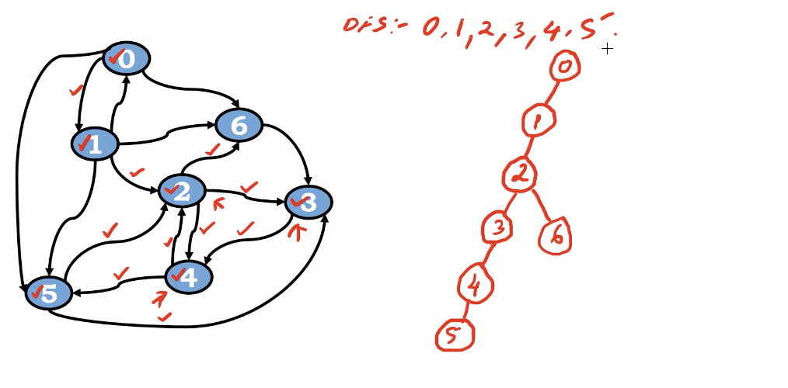
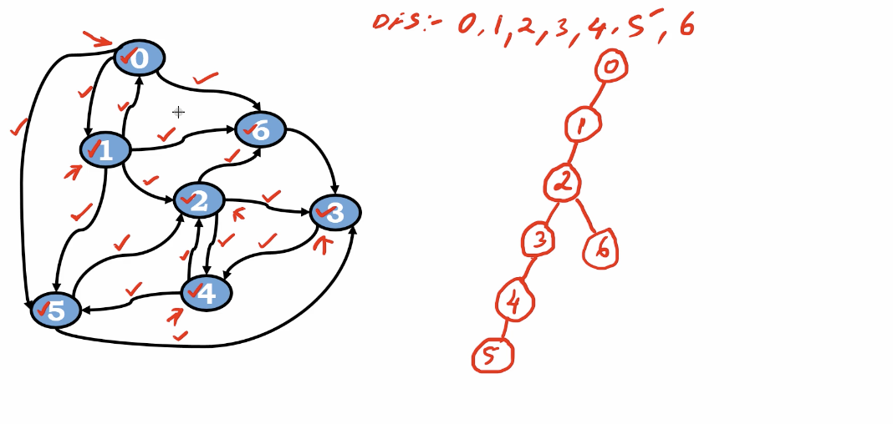

# Depth First Search(DFS)

</img>

</img>

</img>

</img>

</img>

</img>

Now we are at vetex 5

visit 2

visit 3

they are both visited

back to vetex 4

4 

visit 5

visit 2

they are both visited

back to vetex 3

visit 4 - visited

back to vetex 2

visit 3

visit 6

</img>

back to vetex 1

2, 6, 0, they are all visited

back to vetex 0

5, 6, 

they are all visited

Done

</img>

# DFS Algorithm

``` Python
function DFS(s)
   # s holds the vertex index
   # this function will run in a recusive way
   if visited[s] == 0 then
        print(s)
        visited[s] = 1
        for (j = 0, j < n, j++)
            if adjmat[s][j] == 1 && visited[j] == 0 then
                # there is a edge between, vetex is not visited
                # then explore the vetex
                DFS(j)
```

# Complexity Analysis

# Imporvement

It's seems like we could use queue-style design for the dfs algorithm.(which is a candidate)
