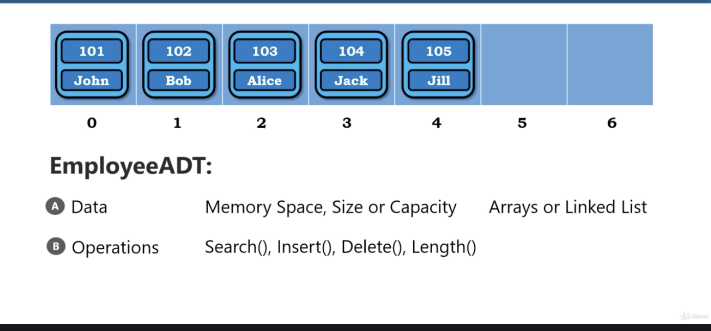

# Data Type

1. Representation of data(How the data represented in the memory, or how the data is store in the memory)

2. Operations(What are the oepration that can be performed on this stored data)

# Primitive Data Type

Primitive - 原始的
int, float, bool, character, ...

| ADT        | representation    | operations                                                     |
|------------|-------------------|----------------------------------------------------------------|
| int x      | 4 bytes in memory | arithmetic operators(+ - * %), relational operators(< > == !=) |
| char s[10] | 2 bytes * 10      | alrithmetic operators(+), Length(), Capacity(), Search()       |

# Abstraction

1. Hidding details

2. fundamental principle of OOP

# Abstract Data Type

1. Abstraction to Data Structure

2. Mathematical model of Data Structure

**ADT specified WHAT each operation does, NOT HOW operations are done**

Employee

</img>
