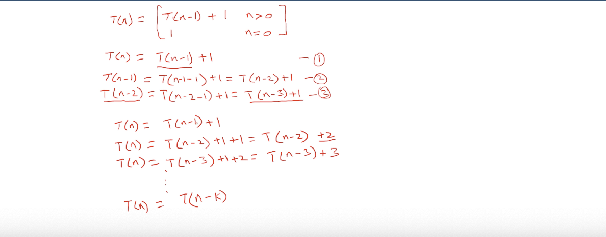
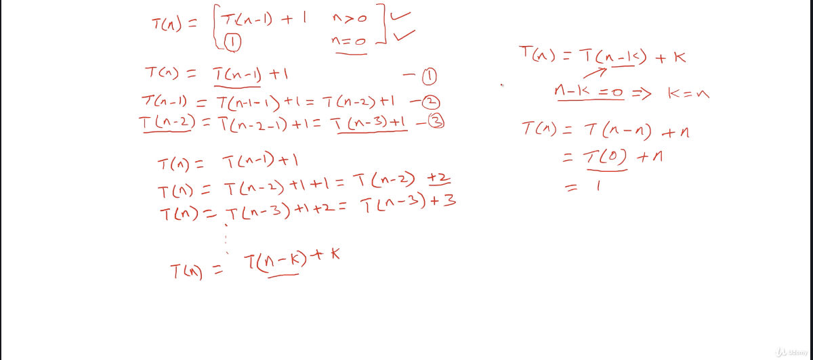

# Time complexity of recursion

1. (Intutive) based on the base case -> unroll the nested function call out. caculate the order of growth.
2. (math) recurrence relation representation

``` Python
def calculatr_rec(n): # T(n)
    if n > 0:  # T(1)
        k = n ** 2  # T(1)
        print(k)  # T(1)
        calculatr_rec(n - 1) # T(n-1)
```

$$
T(n) = 1 + 1 + 1 + T(n-1)
$$

$$
T(n) = T(n-1) + 3 ~~~~ when~ n \geq 0
\\ 1 ~~~~ when~ n \geq 0
$$

apply subsitution method : 

</img>
</img>

In this case, filnally, we have

$$
T(n) = T(n-n) + n = 1 + n
$$

by order of growth

$$
T(n) = O(1 + n) = O(n)
$$
