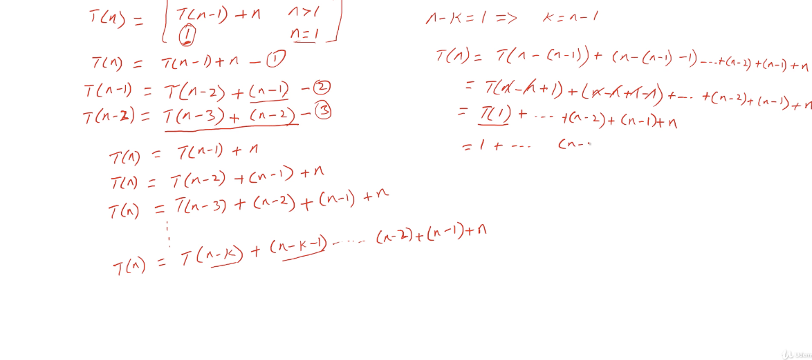

# Another example to analysis time complexity

$$
T(n) = T(n-1) + n ~~ when ~~ n > 1
\\ T(n) = 1 ~~ when ~~ n = 1
$$

unrolling that : 

</img>

$$
T(n) = 1 + ... + n = \frac{n(n+1)}{2}～O(N^{2})
$$

like we solve general term from recusion term
