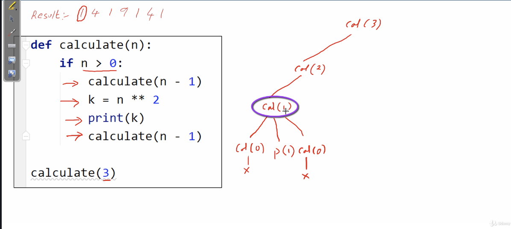
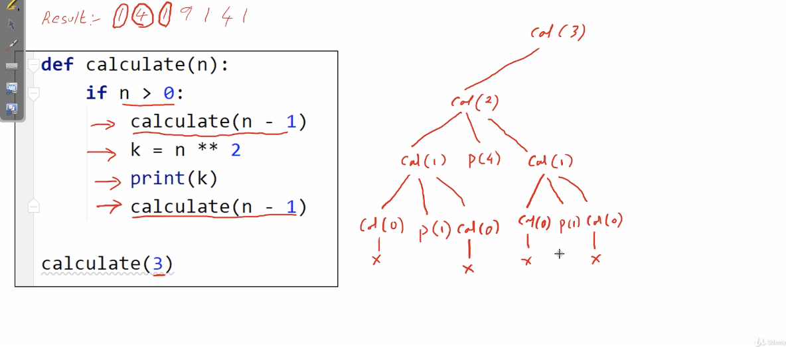
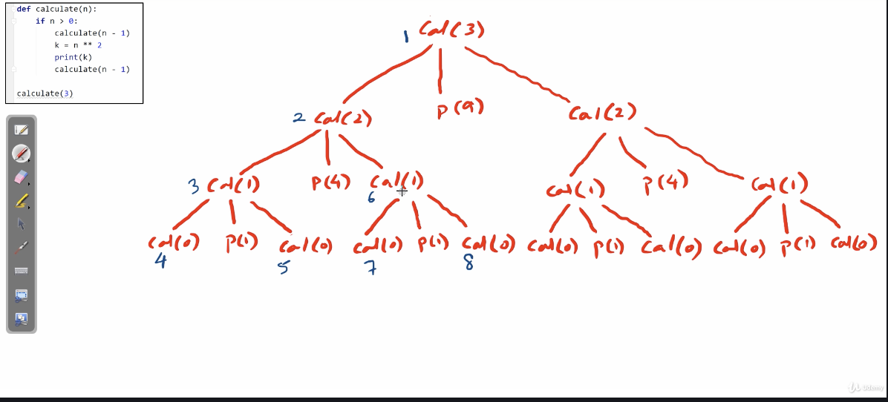
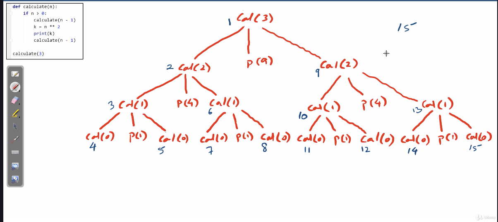
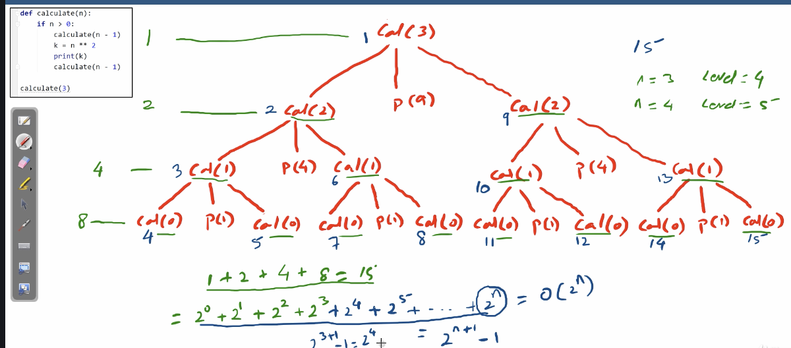

# Tree recursion

</img>

</img>

## tracing the arrangment

</img>

</img>

in this example - we have a 3D recursion

## Time complexity

if we are expanding a tree, the spending time will growth as $2^{N}$ at level $N$

(the same way, if we use a tree to search, in general we will get time complexity $log_{2} N$)

total time to excute a tree recursion

</img>
</img>

just take the biggest term which is $O(2^{N})$
