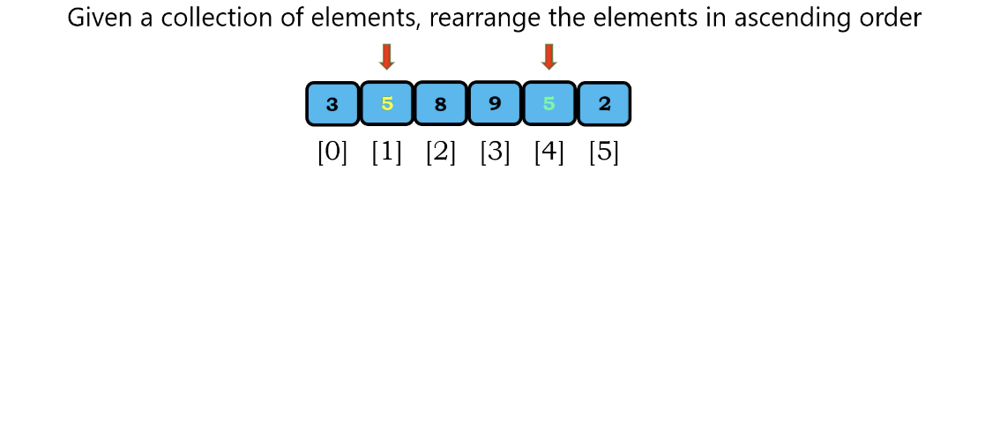

</img>

# Stable Sorting

Stable Sorting : When we sort the array above, the index 1(yellow) will be the front of the index 4(green)

</img>

# Unstable Sorting

Unstable Stable Sorting : When we sort the array above, we don't know which one will be the front and behind(green and yellow)

</img>

# Is it Matter?

For numerical value - it dosn't matter.

For categorical value (like object or somthing else) - it matters!
