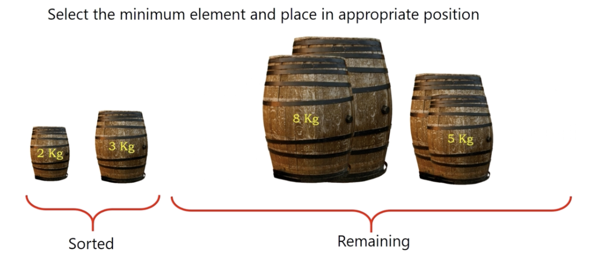
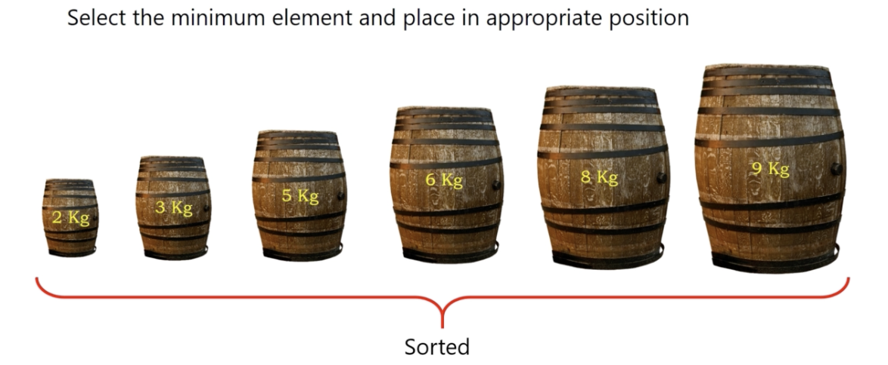

# selection sort

* easiest way to sort an array.

</img>
</img>
</img>
</img>
</img>
</img>
</img>
</img>
</img>

``` Python
Algorithm selectionsort(A)
  n = length(A)
  for i = 0, i < n-1, i++
    position = i
    for j = i+1, j<n, j++
        if A[j] < A[position] then
            position = j
    temp = A[i]
    A[i] = A[position]
    A[position] = temp
```

# Stable or Unstable?

</img>

When i = 1, the element 5 is moved to the last means we lost the positional information when doing sorting.

It's unstable sorting.

# Complexity

Time : $O(N^{2})$

Space : $O(1)$ - only need temp for swapping value
