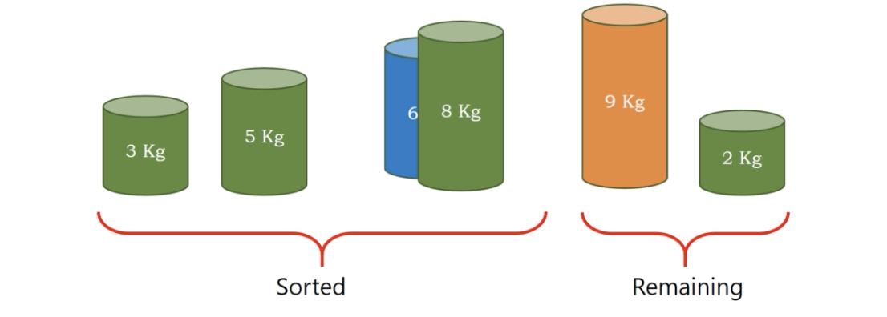

# insertion sort

* select, insert, done =)

</img>
</img>
</img>
</img>
</img>
</img>
</img>
</img>
</img>
</img>
</img>
</img>
</img>
</img>
</img>
</img>
</img>
</img>
</img>

``` Python
Algorithm insertion_sort(A)
  n = length(A)
  for i = 1, i < n, i++
    cvalue = A[i] # cvalue means change values (for swapping)
    position = i
    while position > 0 and A[position - 1] > cvalue
      # check the curr value is sorted or not
      # then perform backward swapping
      A[position] = A[position - 1]
      position = position - 1
    A[position] = cvalue
```

# Stable or Unstable?

</img>

the same element will be stuck when compare with

It's a **stable** sort =)

# Complexity

Time : $O(N^{2})$

Space : $O(1)$ - only need temp for swapping value

basically the same with selection sort
