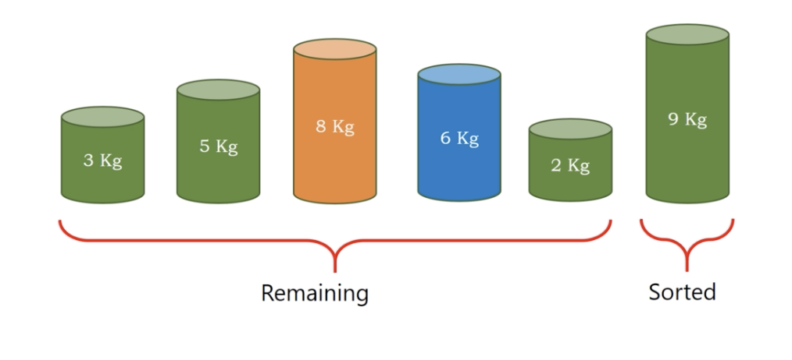

# bubble sort

1. If left element is greater than the right element, swap them.
2. traverse the original array, you will get a maximum element at the last element.

</img>
</img>
</img>
</img>
</img>
</img>
</img>
</img>
</img>

# second round

</img>
</img>
</img>
</img>
</img>
</img>

and third, forth, fifth...

As you could see, the value will sorted partially every iteration, like bubble comes up on the water. It's the name bubble sort.

``` Python
Algorithm bubble_sort(A)
  n = length(A)
  for pass = n-1, pass >=0
    for i = 0, i < pass, i++
      if A[i] > A[i+1] then
        temp = A[i]
        A[i] = A[i+1]
        A[i+1] = temp
```

# Stable or Unstable?

</img>
</img>

stable!

# Complexity

Time : $O(N^{2})$

Space : $O(1)$
