# shell sort

simliar to selection sort.

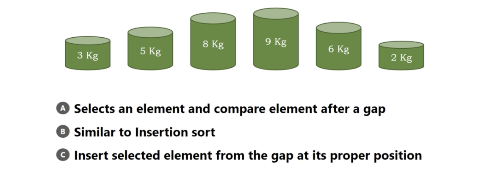</img>

1. fill the gap, gap = $\frac{n}{2} = 3$ 
2. compare the right, if bigger, perform swapping
3. compare the left, if bigger, perform swapping
4. gap = gap / 2

# Example

1. get first gap and traverse.

  
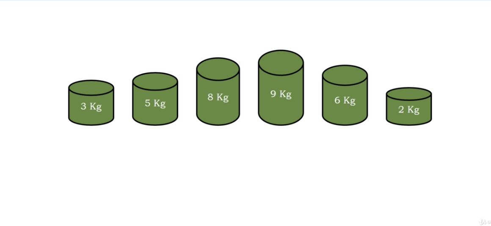</img>
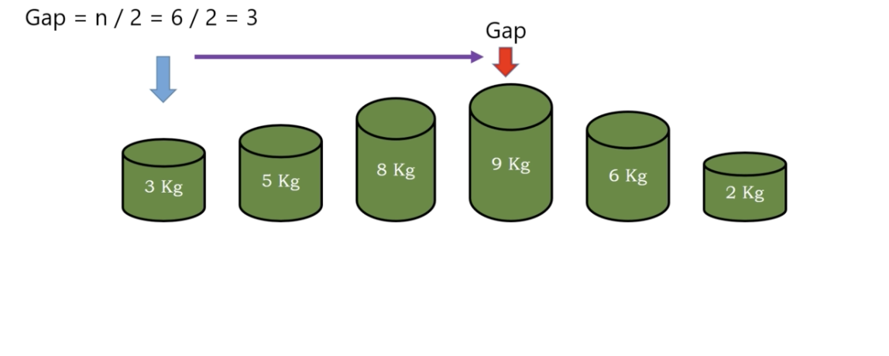</img>
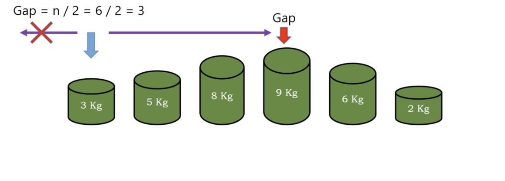</img>
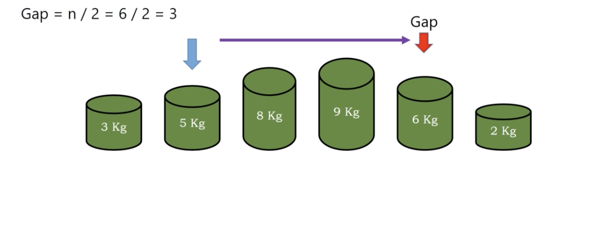</img>
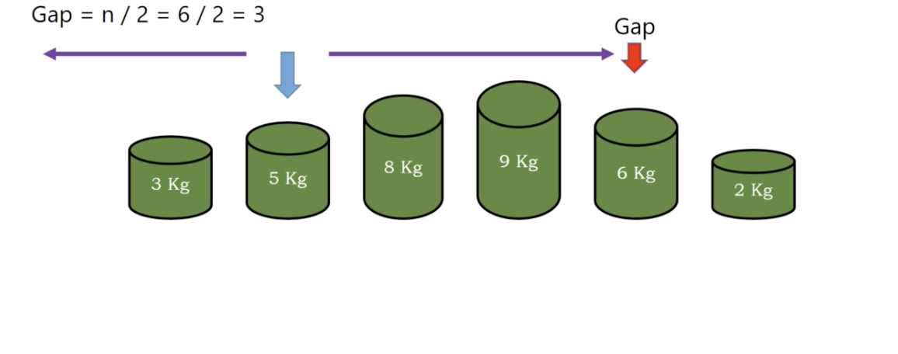</img>
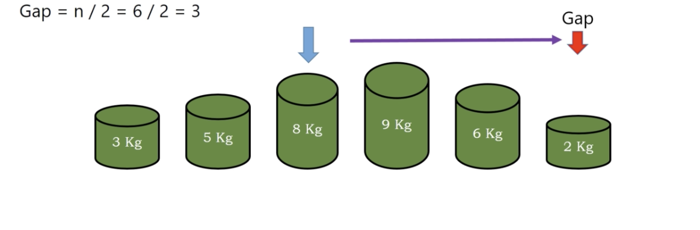</img>
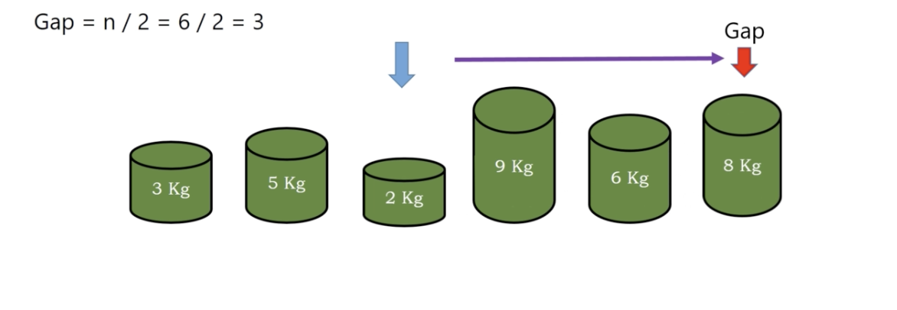</img>

2. second gap

gap /= 2 = 3/2 -> we pick 1

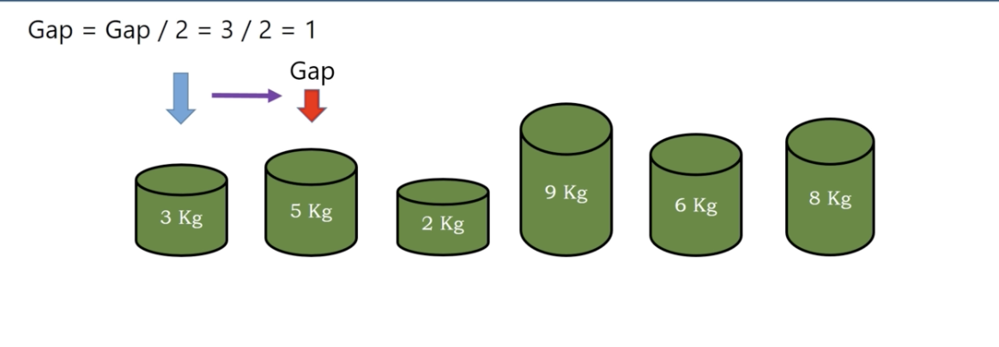</img>
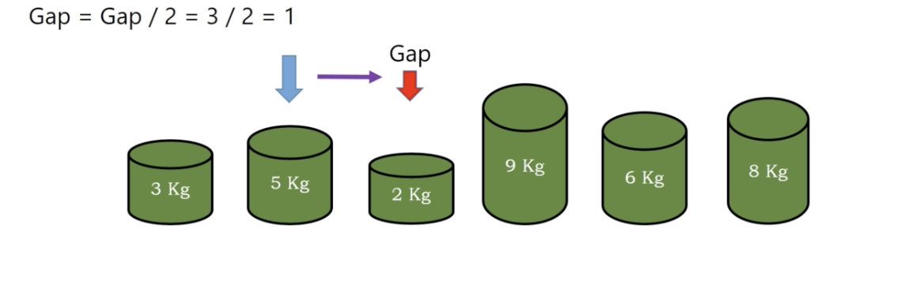</img>
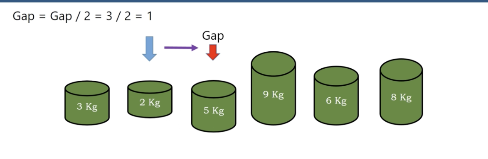</img>
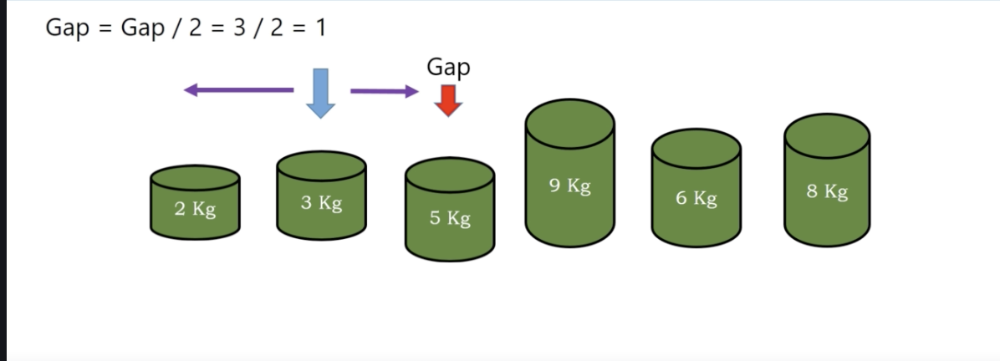</img>
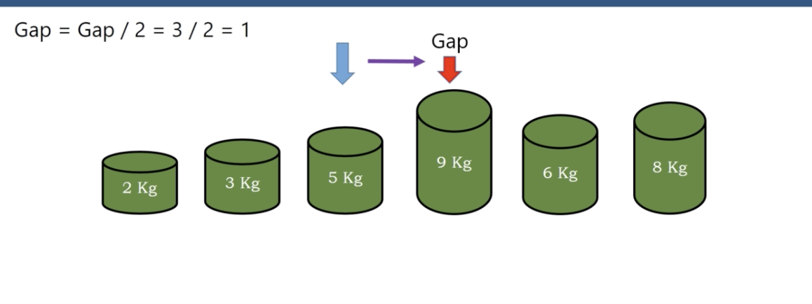</img>
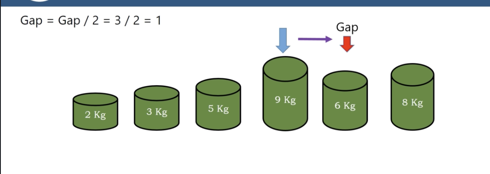</img>
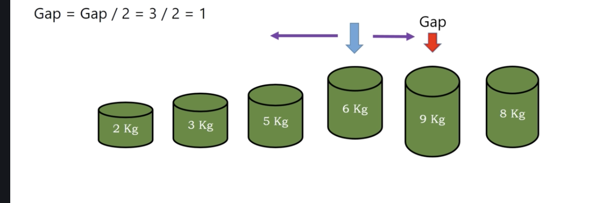</img>
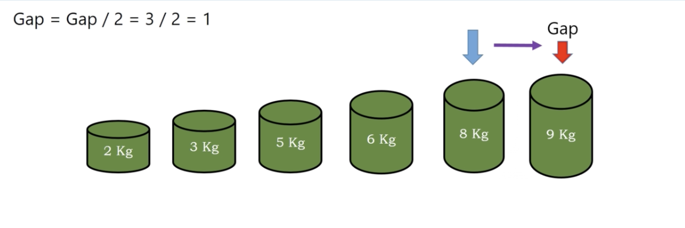</img>
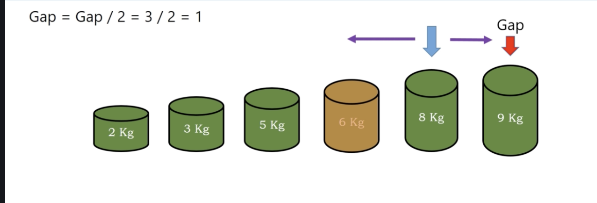</img>
</img>

3. gap = 0, done.

``` Python
Algorithm shell_sort(A)
  n = length(A)
  for gap = n / 2, gap >0, gap = gap/2
    for i = gap, i < n i++
      gvalue = A[i]
      j = i - gap
      while j >= 0 and A[j] > gvalue
        A[j + gap] = A[j]
        j = j - gap
      A[j + gap] = gvalue
```

# Complexity

Rounds : 

gap = n / 2, gap / 2, gap / 2, ..., 0 -> $O(log N)$

traverse all the array : $O(N)$

Time : $O(N log N)$

Space : O(1)

basically the same with selection sort
