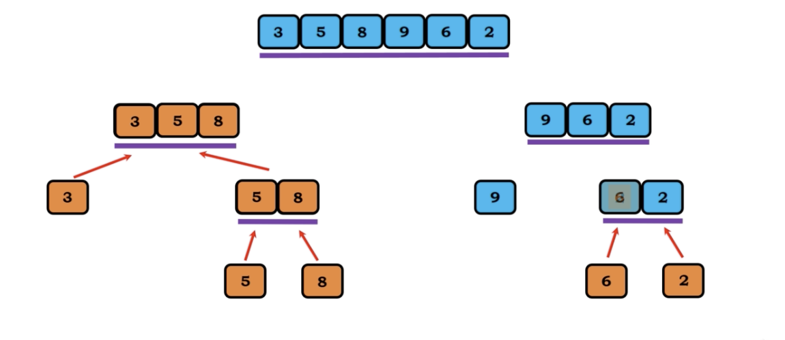
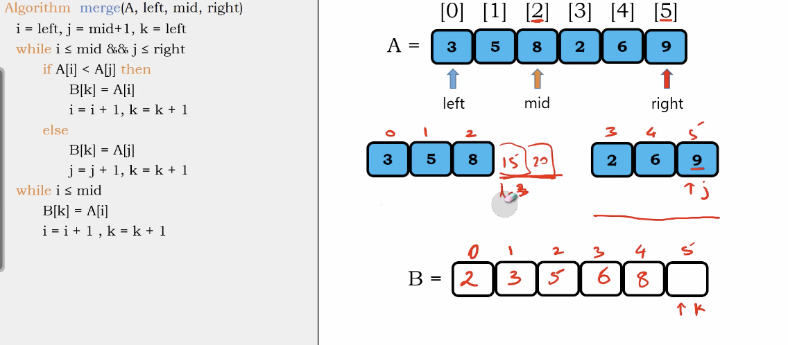

# merge sort

1. divide the collection of elements into smaller subsets
2. recursively sort the subsets
3. combine or merge the result into a solution
4. Divde and Conquer Approach

</img>
</img>
</img>
</img>
</img>
</img>
</img>
</img>
</img>
</img>
</img>
</img>
</img>
</img>
</img>
</img>
</img>
</img>
</img>
</img>
</img>
</img>
</img>

## Tree view

</img>
</img>
</img>
</img>
</img>
</img>
</img>

## Algorithm and Tree View

</img>
</img>
</img>

``` Python
Algorithm merge_sort(A, left, right)
  # no base case, becuase left always smaller than the right
  if left < right then
    mid = (left + right) / 2 # we need a integer here
    merge_sort(A, left, mid) # the left tree
    merge_sort(A, mid + 1, right) # the right tree
    merge(A, left, mid, right) # combine the left part and right part, sorting them

```

## merging and tree view

</img>
</img>
</img>
</img>

merging algorithm need to combine left and right by sorting them.
we use **B** for conbined array

建立3個指標

i : 左邊array的最左邊

j : 右邊array的最左邊

k : Combined array的最左邊

開始比較

``` Python
Algorithm merge(A, left, mid ,right)
  i = left, j = mid+1, k = left
  while i <= mid && j <= right
    # 兩邊互比
    if A[i] < A[j] then
      B[k] = A[i] # 先把小的放進來
      i +=1 # 小的比過了 +1
      k +=1 # Conbined array idx + 1
    else
      B[k] = A[j]
      j += 1
      k += 1
  while i <= mid
    # 如果兩邊互比因為右邊先走到底(j == right)，那麼則會進入到這層
    # 繼續把左邊的元素依序塞進來
    B[k] = A[i]
    i += 1
    k += 1
    while j <= right
    # 如果兩邊互比因為左邊先走到底(i == mid)，那麼則會進入到這層
    # 繼續把右邊的元素依序塞進來
      B[k] = A[j]
      j += 1
      k += 1
    for m = left, m <= right, m++
      A[m] = B[m]
    

```

# Stability

# Complexity

## Merge function

</img>

we need to compare $n_1, n_2$ which is perportion to $n$, a temp array $B$

Time Complexity :  $O(N)$
Space Complexity :  $O(N)$

## Merge_sort function

</img>

A tree view, 

Time Complexity : $O(log_{2}N)$

Space : $O(1)$ 

# Summary

Time Complexity : $O(N log N)$

Space Complexity : $O(N)$
