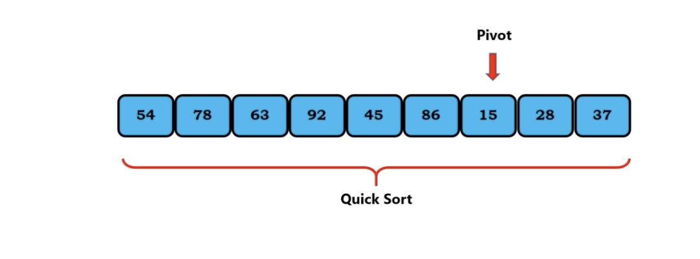

# quick sort

1. divide the collection of elements into subsets or partitions
2. partition based on pivot
3. recursively sort the partitions using quick sort
4. Divde and Conquer Approach

# Pivot

* the elements to the left of povit are smaller than the pivot
* the elements to the right of povit are larger than the pivot

</img>

element 92 couldn't consider as a pivot(this definition will be useful when the problem is devided into small chunk)

</img>

element 54 could consider as a pivot(this definition will be useful when the problem is devided into small chunk)

</img>

element 63 couldn't consider as a pivot

</img>

92 and 15 is the edge of the array, they are both pivots and **sorted positions**

## Partition

</img>

the left part(smaller) -> one part
the right part(larger) -> the other part

This definition is called **partition**

## Quick Sort

0. we have a colletions of elements
1. we select an element as a pivot(start)
2. rearrange the element such that the element match the definition as pivot
3. recursively partition the left part and the right part

the process 1, 2 as known as **partitioning**
quick sort only work when we have more than one element

</img>
</img>
</img>

## An Example

the partitioning

1. i (the left), j(the right), pivot(the left)
2. when i > pivot, i stop
3. when j < pivot, j stop
4. i, j stop -> swap
5. when all the elements are traversed(i cross j)
6. swap j and pivot(rearrange/find a pivot)
7. recursively do the partitioning both left and right
8. the base case is only one element(meaning it is a sorted position)

visulization about left part 

1. moving i to the pivot, then i stop
2. j meet a stop condition
3. i, j, crossed(get an aonther pivot)

  
note the stop condition allow the same value
and the swapped position might be the center of the array

</img>
</img>
</img>
</img>
</img>
</img>
</img>
</img>
</img>
</img>
</img>
</img>
</img>
</img>
</img>
</img>
</img>
</img>
</img>
</img>
</img>

</img>
</img>
</img>
</img>
</img>
</img>
</img>
</img>
</img>
</img>
</img>
</img>
</img>
</img>
</img>
</img>
</img>
</img>
</img>
</img>
