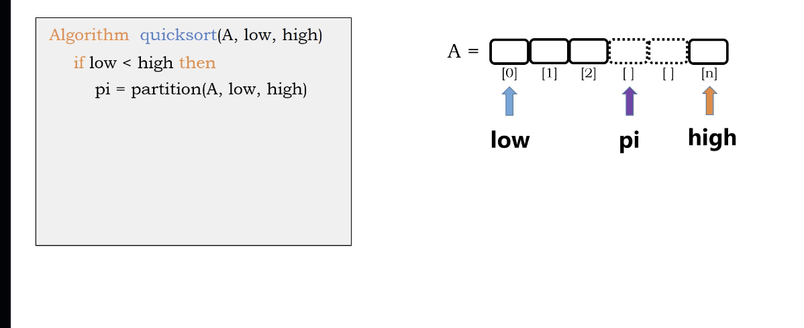

# quick sort algorithm

``` Python
Algorithm quick_sort(A, low, high)
  if low < high then
    pi = partition(A, low, high)
    quick_sort(A, low, pi-1)
    quick_sort(A, pi - 1, high)
```

</img>
</img>

 

``` Python
Algorithm partition(A, low, high)
  pivot = A[low]
  i = low, j = high
  do
    do 
        i += 1 
    while (A[i] <= pivot)
    do 
        j -= 1
    while (A[j] > pivot)
    if i < j then
        swap(A[i], A[j])
  while (i < j)
  swap(A[low], A[j])
```

# Complexity

## On average

</img>
</img>
</img>

Partition at levels : $log_{2}n$

comparisions at each level : $n$

total time complexity : $n log n$

# Worst case?

if we have a sorted array

</img>
</img>

since the j pointer will move to the leftest because we have a sorted array.

all of the comparisions : $n$ + $n-1$ + $n-2$ + ... + $1$

## Tree view of the worst case

</img>

Partition at levels : $n$

comparisions at each level : $n$

total time complexity : $n^{2}$

because we are creating a linked-list! (not balanced binary tree!)
