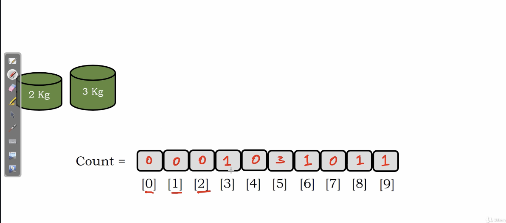
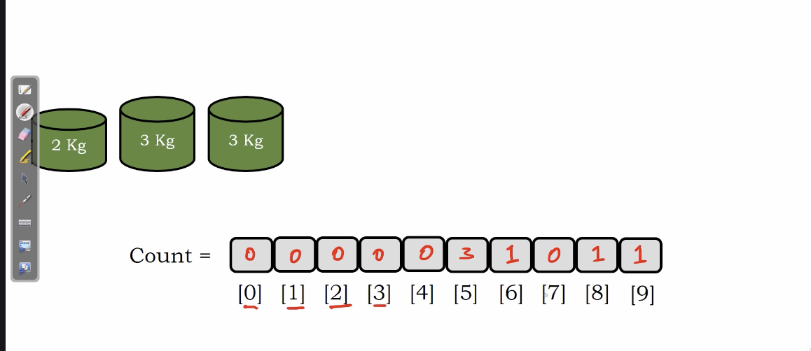

# count sort 

This technique will not compare elements but an index based sorting technique.

1. Initialize a array **(count array)** as the same as the largest element of the original array. and value in in is NULL(or zero).
2. Traverse the orinigal array and plus 1 to **count array**.
3. Traverse the **count array** as a sorted array.

# Example

1. Fill element into **count array**(traverse original array)

</img>
</img>
</img>
</img>
</img>
</img>
</img>

2. Use index to create value(traverse the count array)

</img>
</img>
</img>
</img>

* simple and fast, but a large amount of memory is required.

# Algorithm

``` Python
# Python
Algorithm count_sort(A)
  n = length(A)
  maxsize = max(A) # depends on your programming language built-in functions
  carray = [0, 0, ..., maxsize+1]
  for i = 0, i<n, i++
    carray[A[i]] = carray[A[i]] + 1
  i, j = 0
  # i : the index of count array
  # j : the index of original array
    while i < maxsize + 1
      if carray[i] > 0 then
        A[j++] = i
        carray[i] -= 1
      else
        i += 1
```

# Complexity

Consider the maxmim of array is $M$ , the size of array is $N$

Time : $O(N)$ if $N > M$, $O(M)$ if $M > N$ and we need to find maximum.

Space : $O(M)$
