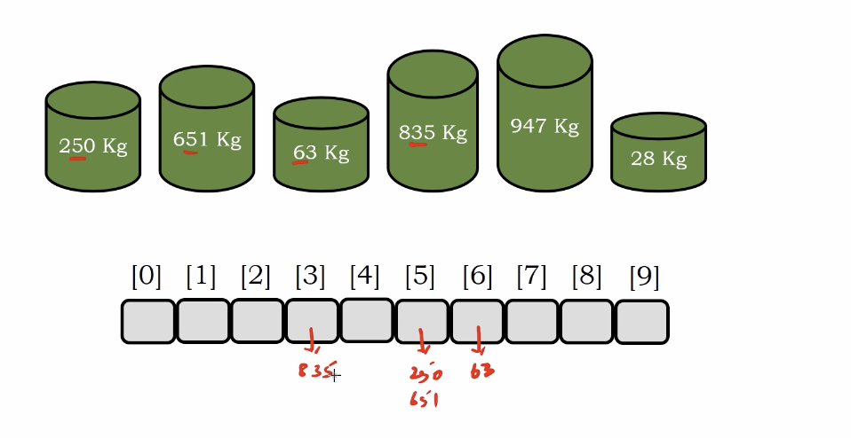
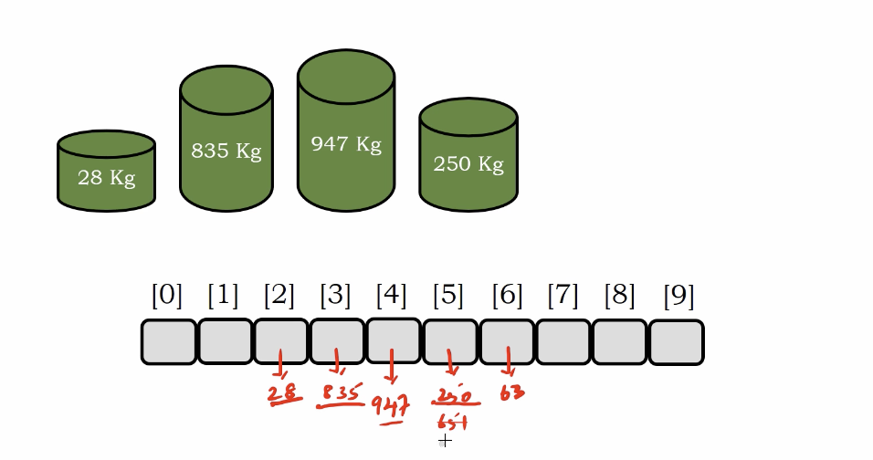
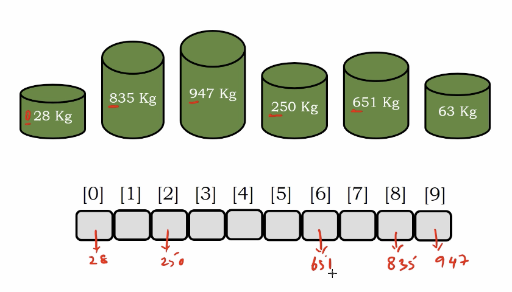
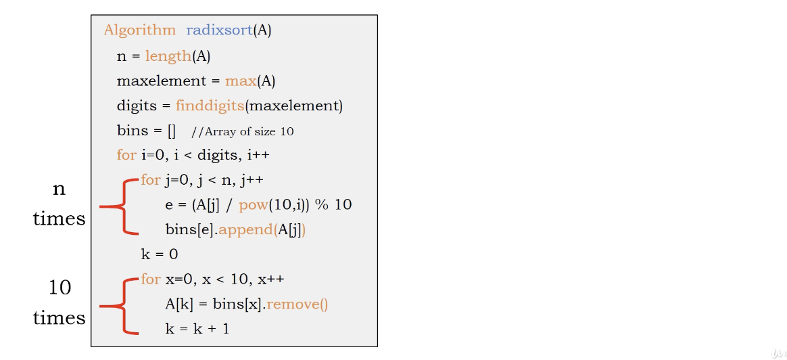

# Radix sort 

This technique will not compare elements but an index based sorting technique(as same as count sort).

based on digits, then we only need 10 buckets

1. Initialize a array only contain 10 element.
2. Loop over the original array and check the least significant digits. point to the tmp array.
3. Rearrange the element by tmp array.
4. Clean up the tmp array.
5. Loop over the original array and check the least second significant digits. point to the tmp array.
6. If we meet the same bucket, just append as a second element
7. repeat 4 - 6

# Example

1. Fill the element into tmp array based on least significant digits

</img>
</img>
</img>
</img>
</img>
</img>
</img>

2. rearrange them by tmp array.

</img>
</img>

3. point to the tmp array with second lastest digits.

</img>
</img>
</img>
</img>
</img>

4. rearrange them

</img>
</img>
</img>
</img>
</img>
</img>

5. refill them, now we are in 3 digits round. `028`,                 `063` will be assigned to first bucket(`0` in the tmp array)

</img>
</img>
</img>
</img>
</img>
</img>

6. rearrange them

</img>
</img>
</img>
</img>
</img>

* simple and fast, but a large amount of memory is required.

# Algorithm

``` Python
# Python
Algorithm count_sort(A)
  n = length(A)
  maxelement = max(A)
  digits = finddigits(maxelement)
  bins = [] # array or linked-list, size 10
  for i=0, i < digits, i++
    for j = 0, j < n, j++
      e = A[j] / pow(10, i) % 10 # the radix of each digits
      bins[e].append(A[j])
    k=0
    for x=0, x<10 x++
    # since we have only 10 element in radix array
      A[k] = buns[x].remove()
      k += 1
  
```

# Complexity

</img>
</img>
</img>

Consider the maxmim element is $d$ digits, the size of array is $N$

Time : $O(dN)$

Space : $O(N)$

Though only ten bins we created, but we need to append element into the bins. Hence, we using list, then we got $O(N)$
