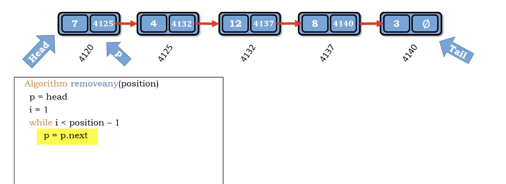
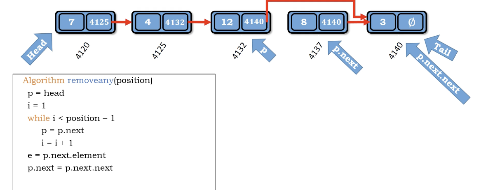

# Idea

1. 先走到該位置(p)

2. 將p的指標跳過一個Node

</img>
</img>

``` Python
Algorithm remove_any(position)
    p = head
    i = 1
    while i < position - 1
        p = p.next
        i += 1
    e = p.next.element # the value we delete (we want to return it)
    p.next = p.next.next
    size -= 1
    return e

```

Time Complexity : $O(N)$

Space Complexity : $O(1)$
