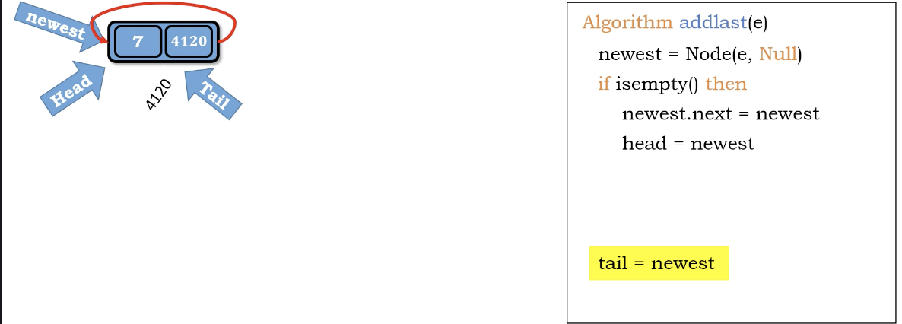
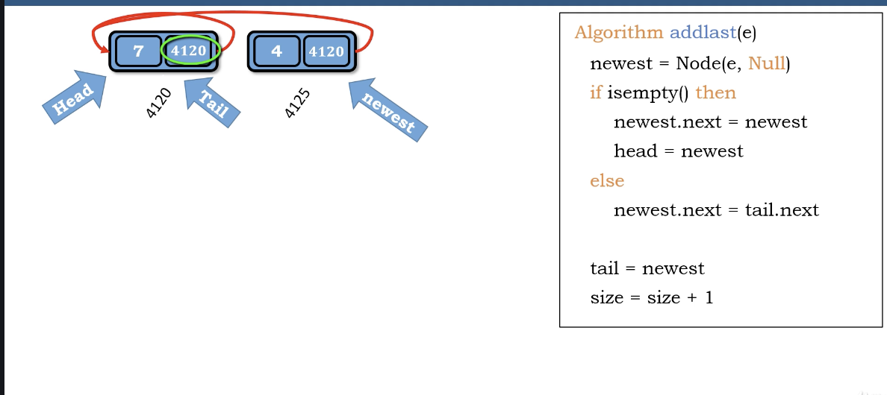

# Create 

1. empty - first node 

   * head = newest
   * but it is a circular linked list, so we can't assgin pointer to none, **make pointer to point itself** -> newest.next = newest

2. non-empty 

   * newest.next = tail.next (add the circle)
   * tail.next = newest (add new node)
   * tail = newest (move tail to newest)

</img>
</img>

``` Python
Algorithm addlast(e)
    newest = Node(e, Null)
    if is_empty() then
        newest.next = newest # circular
        head = newest
    else
        newest.next = tail.next # curcilar
        tail.next = newest # add node
    tail = newest
    size += 1

```

Time complexity : $O(1)$

Space compleixty : $O(1)$
