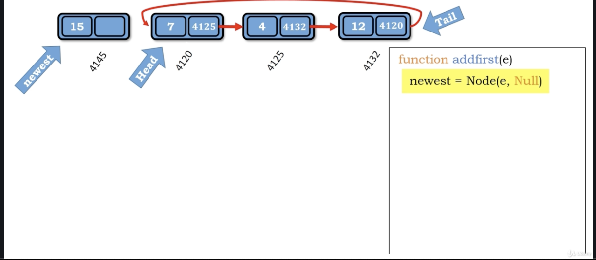
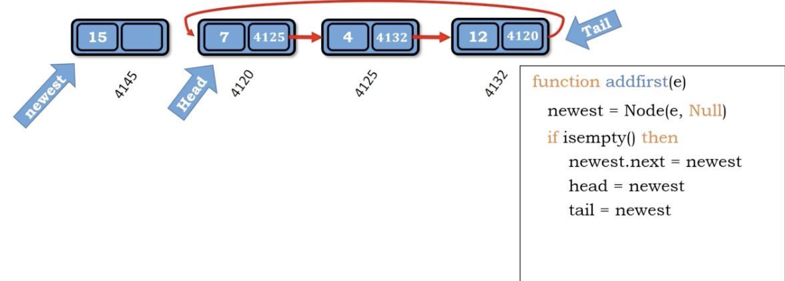

# idea

1. 開一個新的Node

2. if List 空

   1. 建立circular
   2. head, tail都指到新Node

3. else

   1. tail.next = newewst (建立circular)
   2. newest.next = head (新的變成第一個，指到剩下的list)
   3. head搬到前面，指向newest

</img>
</img>

``` Python
Algorithm add_first(e)
    newest = Node(e, Null)
    if is_empty() then
        newest.next = newest
        head = newest
        tail - newest
    else
        tail.next = newest
        newest.next = head
        head = newest
    size += 1 

```

Time complexity :  $O(1)$

Space compleixty : $O(1)$
