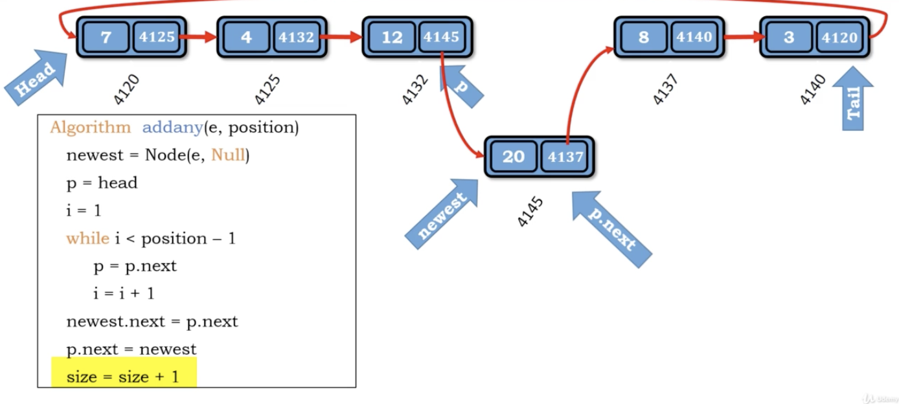

# idea

1. 開一個新的Node
2. 走到input給定的position(需要p = head, i = 1)
3. 把新的Node插進去(就算是head和tail都適用)

   1. newest.next = p.next
   2. p.next = newest

</img>
</img>
</img>

``` Python
Algorithm add_any(e, position)
    newest = Node(e, Null)
    p = head
    i = 1
    while i < position - 1
        p = p.next
        i += 1
    newest.next = p.next
    p.next = newest
    size += 1 

```

Time complexity : $O(N)$

Space compleixty : $O(1)$
