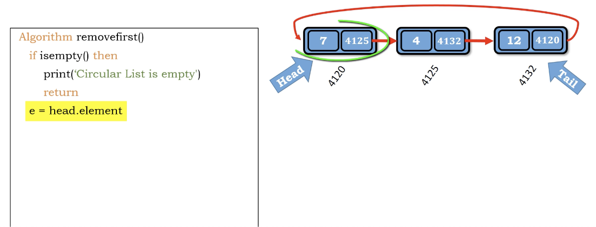
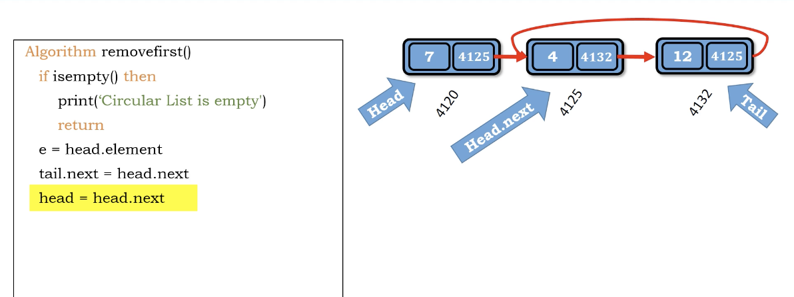

# idea

1. if empty - return
2. else

   1. e = head.element(這是要刪掉的，可以拿來return)
   2. tail.next = head.next(把尾巴指向head的下一個)
   3. head = head.next(把head搬到下一個)
   1. size -= 1

3. if empty

   1. head = Null
   2. tail = Null

4. return e

</img>
</img>

``` Python
Algorithm remove_first()
    if is_empty() then
        print('circular list is empty')
        return
    e = head.element
    tail.next = head.next
    head = head.next
    size -= 1
    if is_empty() then
        head = Null
        tail = Null
    return e

```

Time complexity : $O(1)$

Space compleixty : $O(1)$
