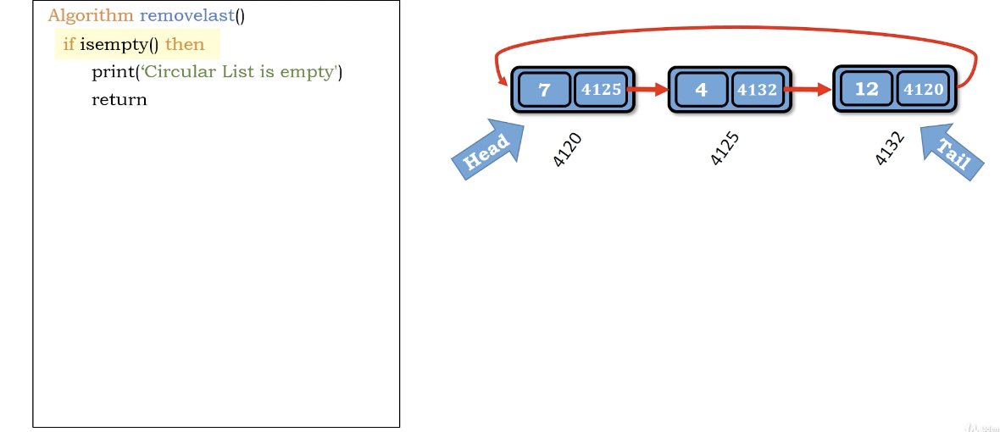
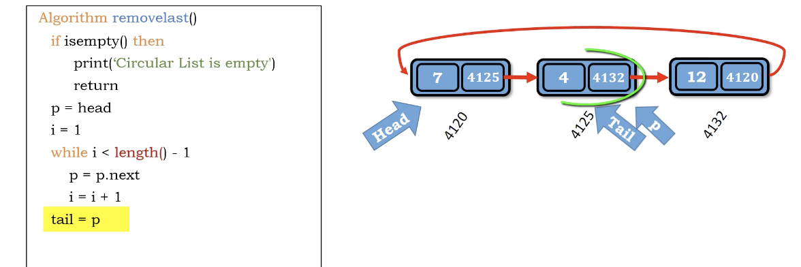

# idea

除了remove，還要把最後一個接到最前面，變成circular

1. if empty - return
2. 走到倒數第2個(p=head, i=1)
3. tail = p (把tail往前)
4. p = p.next (將目前指標指到最後)
5. tail.next = head (circluar)
6. e = p.element (取得要丟掉的值)
7. size -= 1
8. return e

</img>
</img>

``` Python
Algorithm remove_last()
    if is_empty() then
        print('circular list is empty')
        return
    p = head
    i = 1
    # point to last two 
    while i < length() - 1
        p = p.next
        i += 1
    tail = p
    p = p.next
    tail.next = head
    e = p.element
    size -= 1
    return e

```

Time complexity : $O(N)$

Space compleixty : $O(1)$
