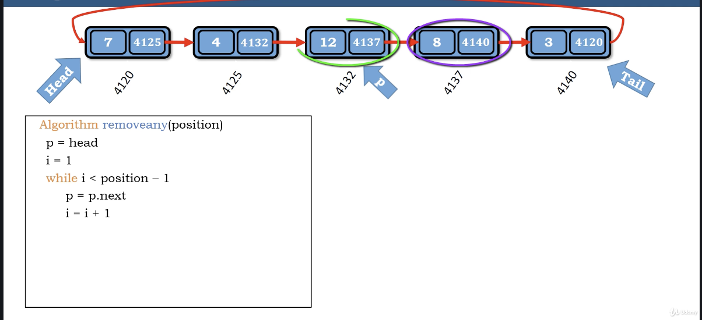
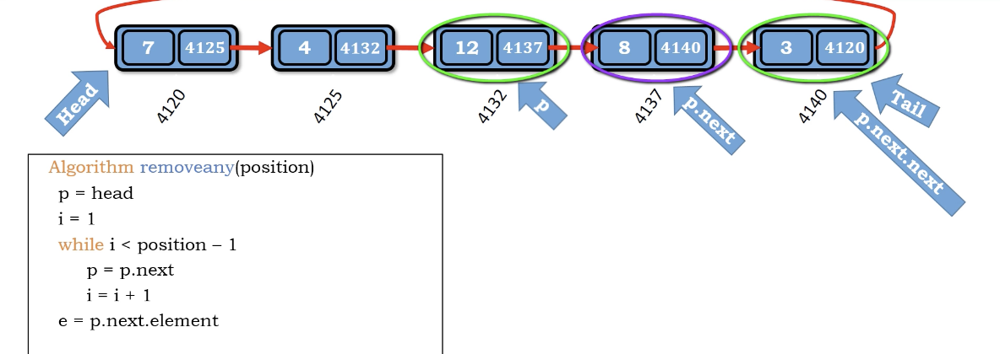
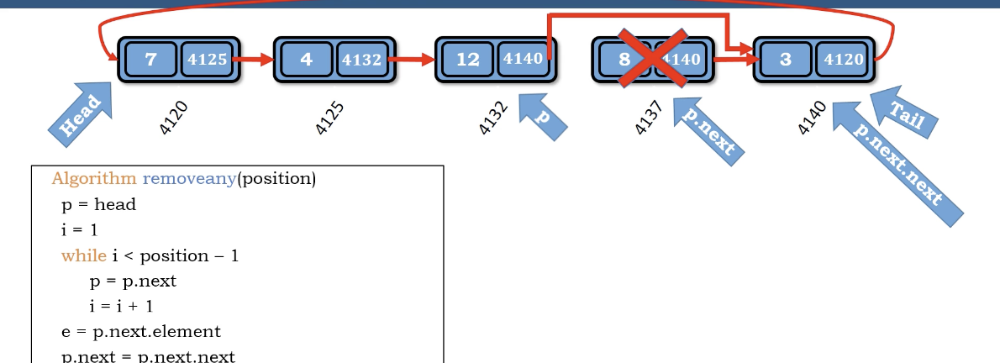

# idea

基本上和linked-list一樣

1. 走到給定的位置
2. e = p.next.element (拿到要刪除的值)
3. p.next = p.next.next (掉過要殺掉的node)
4. size -= 1
5. return e

</img>
</img>
</img>

``` Python
Algorithm remove_any()
    p = head
    i = 1
    while i < position - 1
        p = p.next
        i += 1
    e = p.next.element
    p.next = p.next.next
    size -= 1
    return e
```

Time complexity : $O(N)$

Space compleixty : $O(1)$
