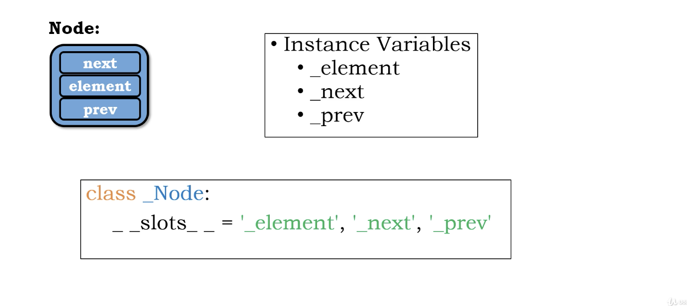
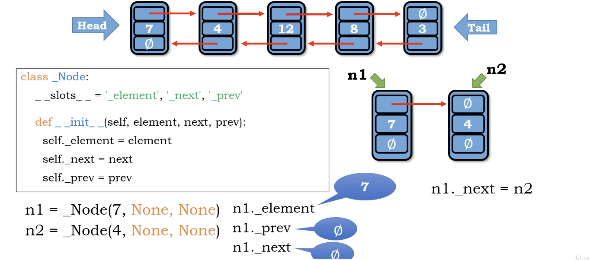
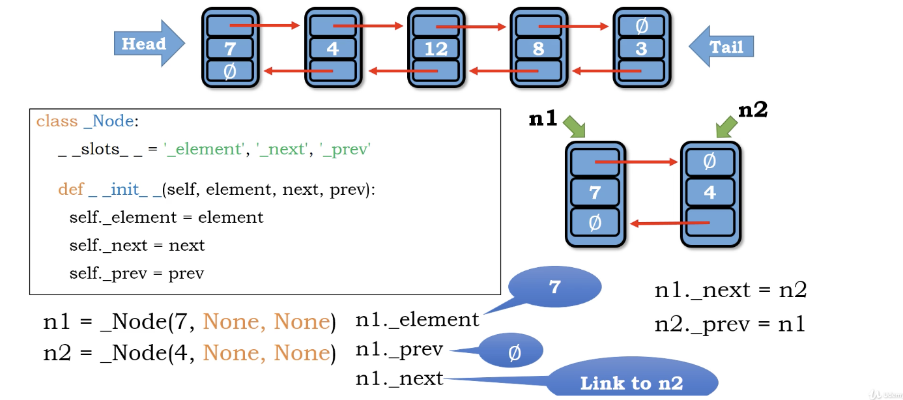

# Node of double linkedlist

one value and tewo pointer(next and prev)

# more about __slot__

how memory is allocated to the class in python?

any class in python will created using built-in dictionaryu class to map all the members

In this case, python need to create 3 members **_element**, **_next**, **_prev** for building a class (which requires addtional memory).

And everytime we create a Node object, python will keep create dict to feed into class.

To reduce useless operation in certain condition, python provides **__slot__** to efficiently allocate memory without creating dict

</img>
</img>
</img>
