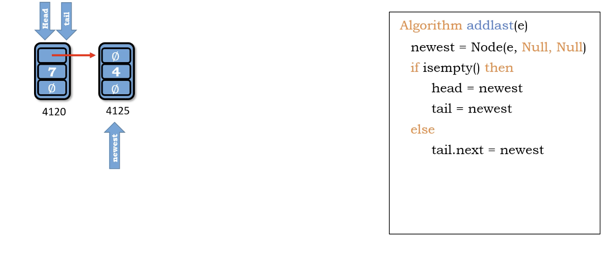
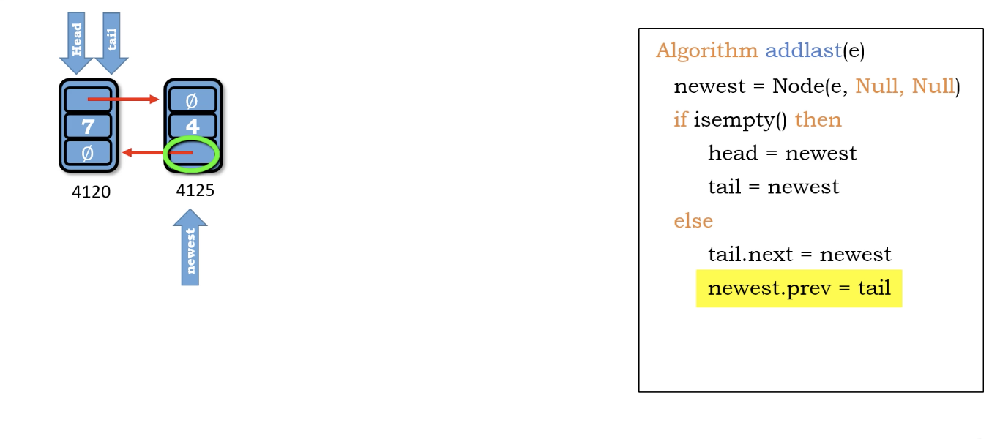
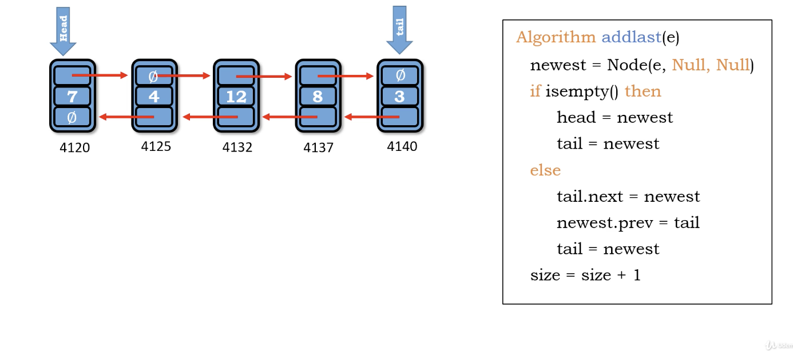

# Traversing nodes of double linked list

we need two links.

1. link newest to the last
2. link the newest.prev to last

</img>
</img>
</img>

``` Python
Algorithm add_last(e)
    newest = Node(e, Null, Null)
    if is_empty() then
        head = newest
        tail = newest
    else
        tail.next = newest
        newest.prev = tail
        tail = newest
    size += 1
```

Time : $O(1)$

Space : $O(1)$
