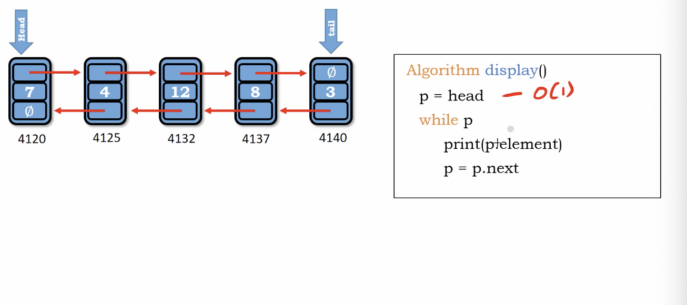

# Traversing nodes of double linked list

same as we use in single linked list

</img>

``` Python
Algorithm display()
    p = head
    while p
        print(p.element)
        p = p.next
```

Time : $O(N)$

Space : $O(1)$
