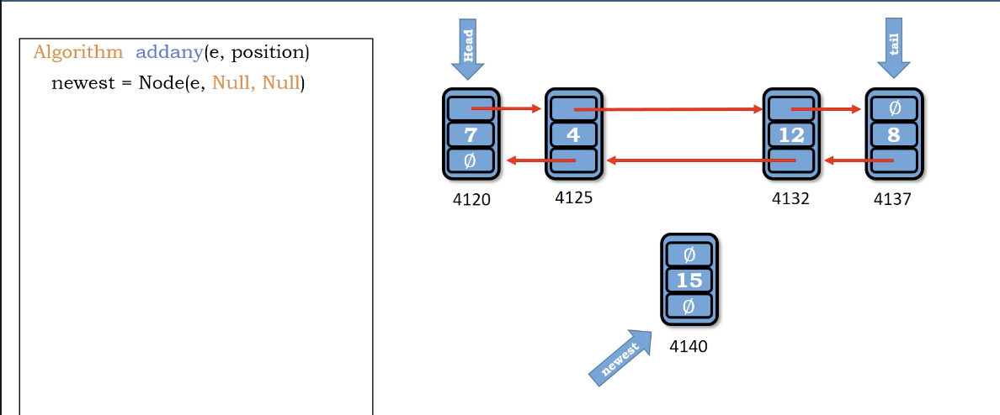
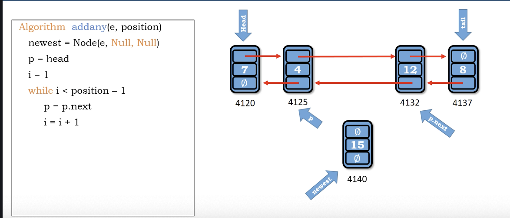
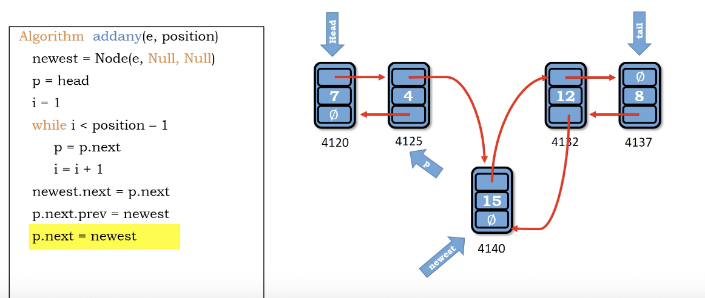
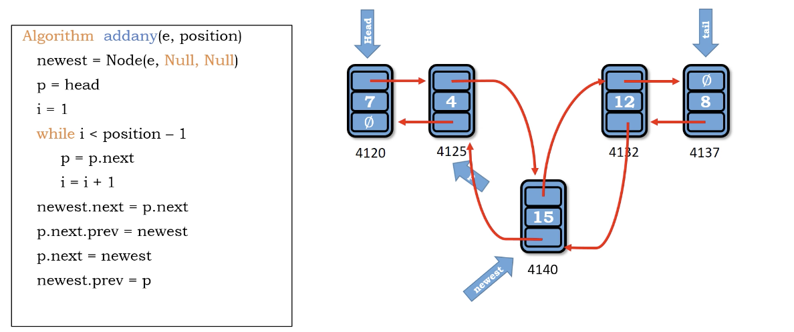

# add any in double linked list

1. 走到要插入的地方(需邊界案例處理)
2. 插Node進去，稍微小複雜(因為左右都有node，要連4次)

</img>
</img>
</img>
</img>

``` Python
Algorithm add_any(e, position)
    newest = Node(e, Null, Null)
    p = head
    i = 1
    while i < position - 1
        p = p.next
        i += 1
    newest.next = p.next
    p.next.prev = newext
    p.next = newest
    newest.prev = p

```

Time : $O(N)$

Space : $O(1)$

# additional materials

https://dbader.org/blog/python-linked-list
