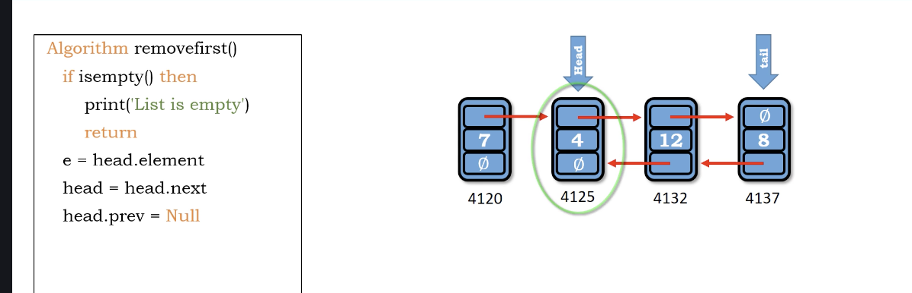

# delete first in double linked list

1. if 空 - return
2. 取得要刪除的value - e = head.element
3. 把head指到2nd node - head = head=head.next
4. 把2nd node的prev換成 null - head.prev = Null
5. size -= 1
6. 如果list被殺光了，tail = Null

</img>

``` Python
Algorithm delete_first()
    if is_empty() then
        print('List is empty')
        return
    e = head.element
    head = head.next
    head.prev = Null
    size -= 1
    if is_empty() then
        tail = Null
    return e
```

Time : $O(1)$

Space : $O(1)$

# additional materials

https://dbader.org/blog/python-linked-list
