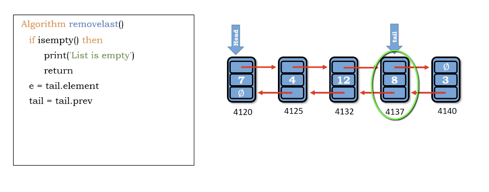

# delete last in double linked list

**much easier deletion compare to single linked-list**

Because single linked list need to traverse to the end
but we only need to use tail.prev in double linked list

1. if 空 - return
2. 取得尾端要刪除的node以及他的值 - e = tail.element
3. 把tail往前指 - tail = tail.prev
4. 把tail的next指Null - tail.next = Null
5. size -= 1
6. (不用處理刪除之後會是空，因為tail.next = Null)已經執行了

</img>
</img>

``` Python
Algorithm delete_last()
    if is_empty() then
        print('List is empty')
        return
    e = tail.element
    tail = tail.prev
    tail.next = Null
    size -= 1
    return e
```

Time : $O(1)$

Space : $O(1)$

# additional materials

https://dbader.org/blog/python-linked-list
