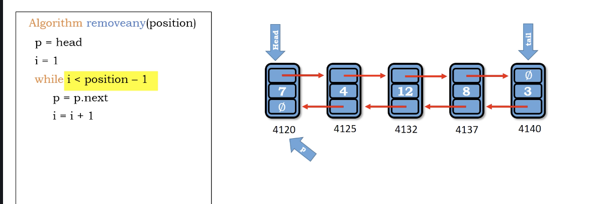
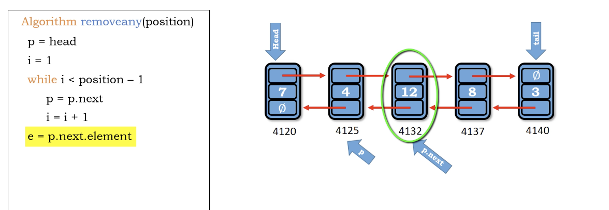
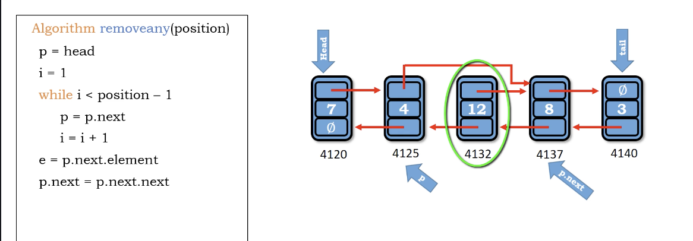
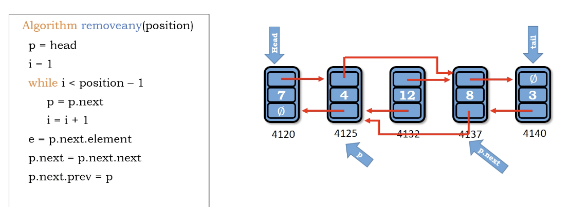
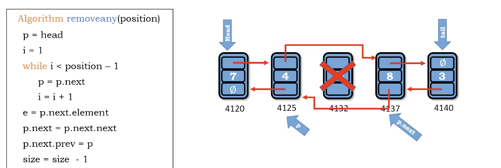

# delete any in double linked list

we still have time complexity $O(N)$ ... sad =(

1. traverse to the given position
2. get the node and value we want delete - e = p.next.element
3. point the p node cross the deletion - p.next = p.next.next
4. point the cross p node back by crossing the deletion - p.next.prev = p
5. size -= 1

</img>
</img>
</img>
</img>
</img>

``` Python
Algorithm delete_any(position)
    p = head
    i = 1
    while i < position -1
        p = p.next
        i += 1
    e = p.next.element
    p.next = p.next.next
    p.next.prev = p
    size -= 1
    return e
```

Time : $O(N)$

Space : $O(1)$
