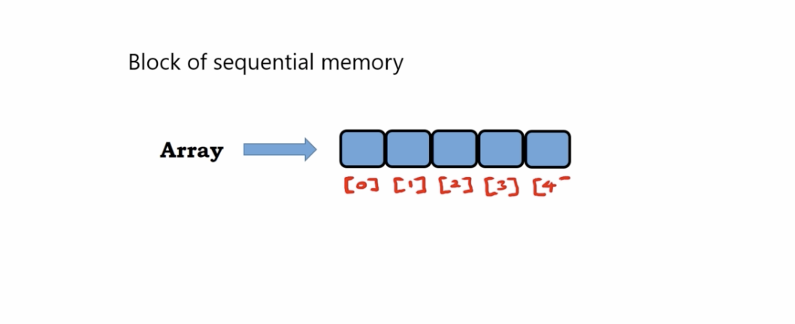
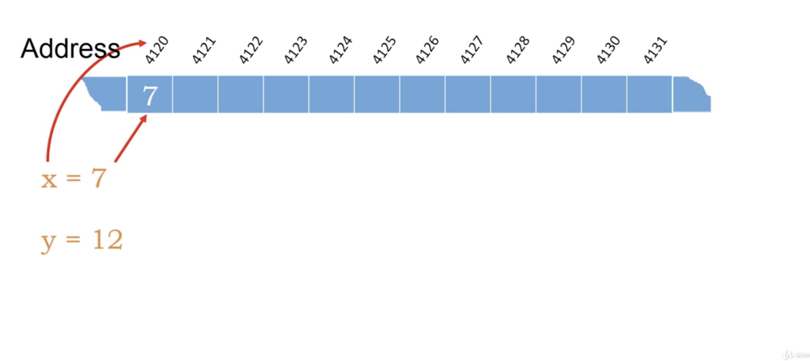
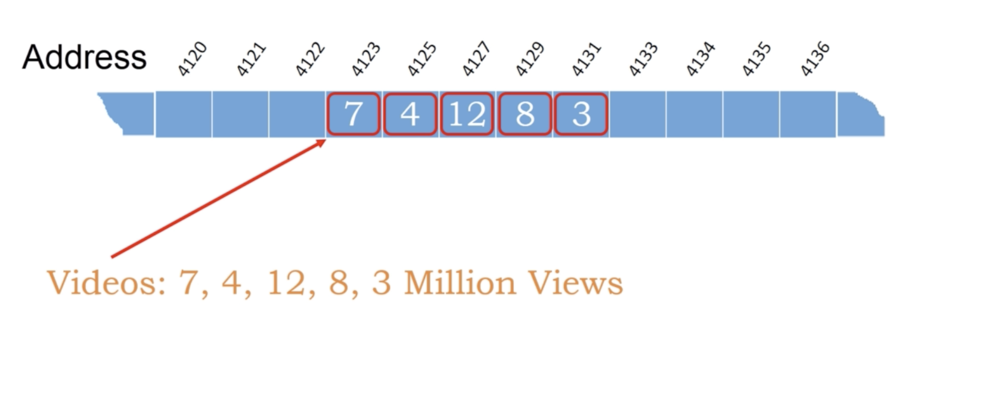
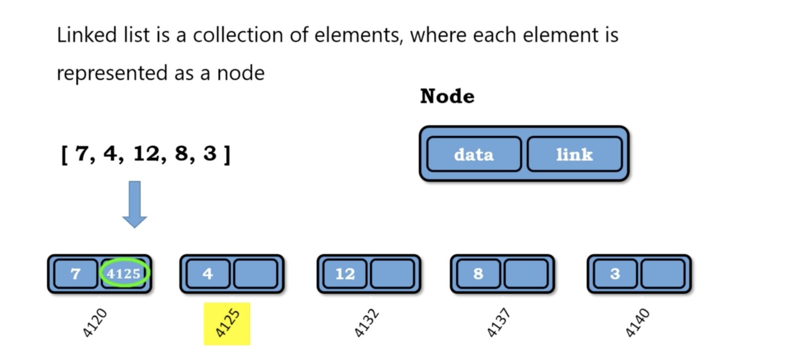
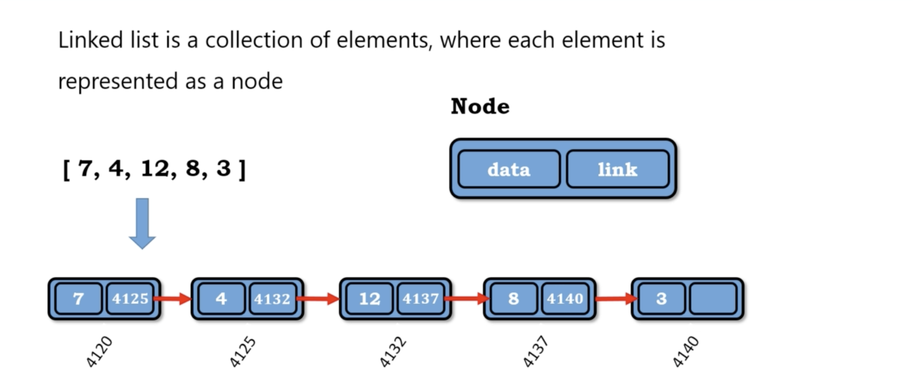
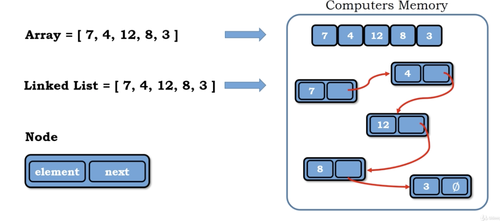

# What is an Array

Block of sequenrial memory
</img>

# Sequence in Python

Built-in Sequence classes

all support indexing

list (mutable)

tuple (immutable)

str (immutable)

# Low-level representation of computer memory

adress map to memory

</img>

</img>

array is fixed size chunk of memory

# Limitations of Arrays

1. All elements or data must be of same type(all of integer, string, specific object)

2. Array are of fixed size - Immutable (means one array is declared size cannot be changed, and ther are stored sequentially)

# What is a Linked List and Why do we use

Linked-list is a collection of elements, where each element is represented as a node

Node contains : 

1. data

2. link

</img>

</img>

Why we use linked-list as a data structure?

1. In reality, we don't know how many elementys we need to store, then we use linked-list.

   - More specifically, if we want to growth the array, we need to create a new one, then copy the elements in old one to new one.

2. linked list use the computer memory more effient than array.

</img>
