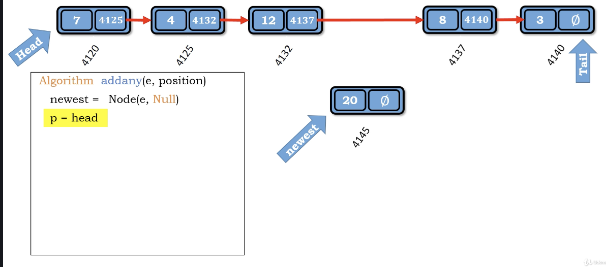

# Idea

開一個Node，輸入要放的位置，先指到該位置，然後指標指進去
這裡採用雙指標(head, tail)

圖示法把head, tail, p (current node), p._next, newest都標出來，會更容易寫算法

</img>

``` Python
Algorithm addany(e, position)
    newest = Node(e, Null)
    p = head
    i = 1
    while i < position - 1
        p = p.next
        i += 1
    newest.next = p.next
    p.next = newest
    size += 1

```

most important part :

`newest.next = p.next` : 要加入的node 指向要插入的位置的後面node
`p.next = newest` 將原本連好的node取先連結，並指向要插入的node

Time Complexity : $O(N)$

Space Complexity : $O(1)$

worst case is add to the last, take N steps to compelete.
